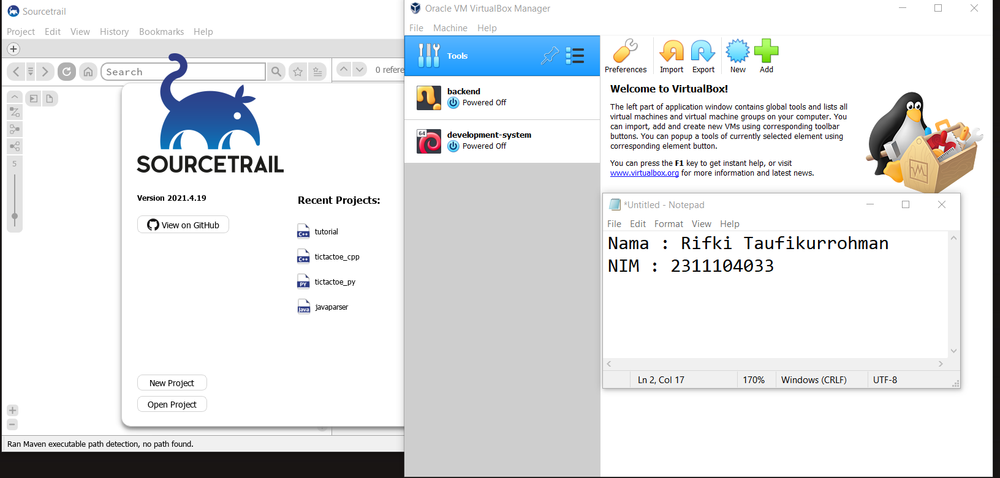

# <h1 align="center">Laporan Praktikum Modul 01  Running Modul</h1>

Rifki Taufikurrohman - 2311104033

## Dasar Teori

Oracle VM VirtualBox adalah perangkat lunak virtualisasi yang membuat pengguna menjalankan sistem operasi lain di dalam sistem operasi utama tanpa perlu melakukan instalasi ulang pada komputer. Dengan VirtualBox pengguna dapat membuat mesin virtual yang berfungsi seperti komputer terpisah di dalam satu perangkat fisik.

Xinu OS adalah sistem operasi sederhana yang dirancang khusus untuk tujuan pendidikan. Nama Xinu merupakan singkatan dari “Xinu Is Not Unix”. Sistem operasi ini digunakan untuk mempelajari konsep dasar sistem operasi seperti manajemen proses, manajemen memori, dan penjadwalan CPU. Xinu biasanya digunakan dalam perkuliahan Teknik Informatika atau Ilmu Komputer untuk memahami cara kerja kernel secara langsung.

Ubuntu adalah salah satu distribusi (distro) Linux yang berbasis Debian, dikembangkan oleh Canonical dan dirilis secara open-source untuk memberikan sistem operasi gratis, andal, dan mudah digunakan pada komputer desktop, laptop, maupun server. Berlandaskan pada kernel Linux yang stabil, Ubuntu berfokus pada kemudahan penggunaan (user-friendly), keamanan, serta dukungan perangkat keras yang luas melalui interface intuitif.

Sourcetrail adalah cross-platform source explorer yang dirancang untuk membantu pengembang perangkat lunak memahami dan menavigasi kode sumber (codebase) yang kompleks dan tidak dikenal. Alat ini bekerja dengan melakukan analisis statis (indexing) secara offline terhadap kode sumber untuk memetakan kelas, fungsi, dan variabel, lalu menampilkannya dalam visualisasi grafis interaktif yang menghubungkan dependensi antar simbol.

## Guided

Pada Modul 1 ini melakukan installasi Virtual Box, SourceTrail, dan Ubuntu.

## Referensi

1. https://en.wikipedia.org/wiki/Virtual_machine
2. https://en.wikipedia.org/wiki/Xinu