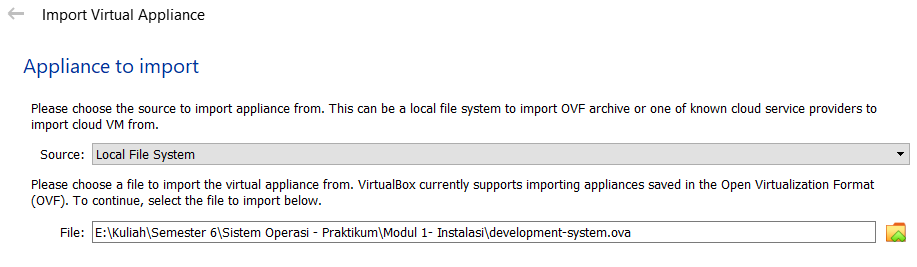
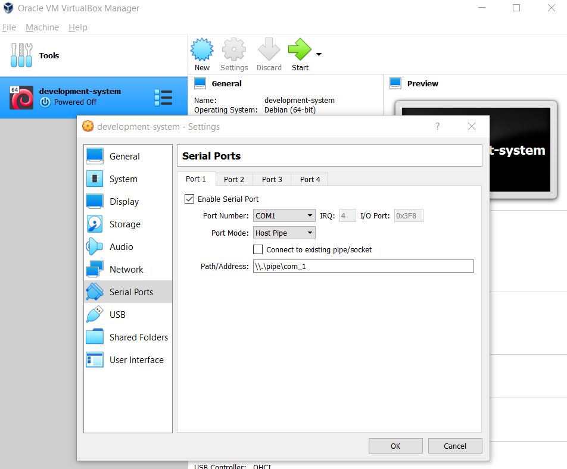
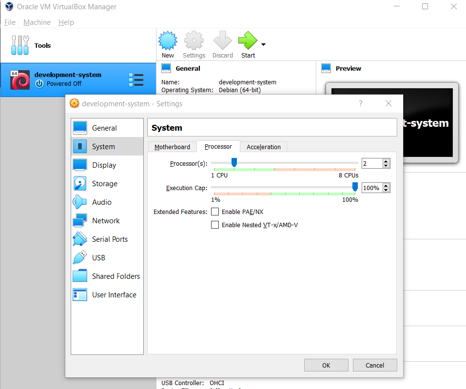
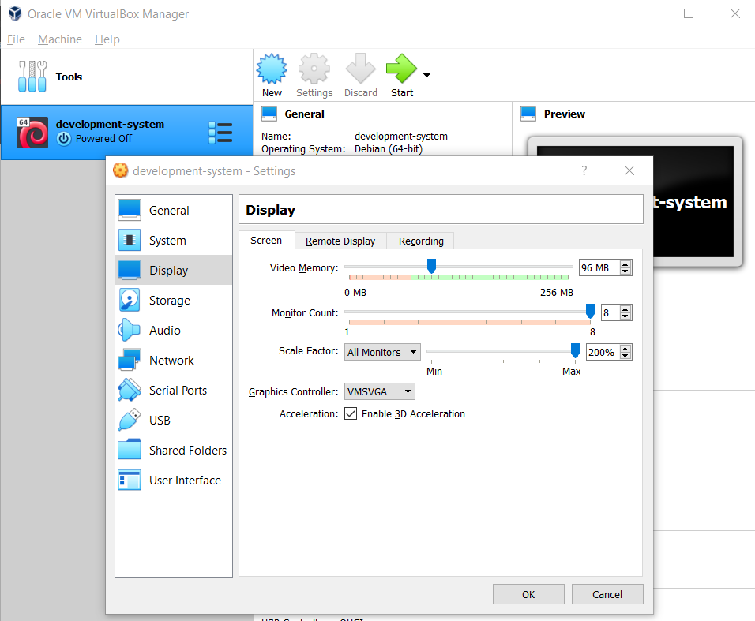
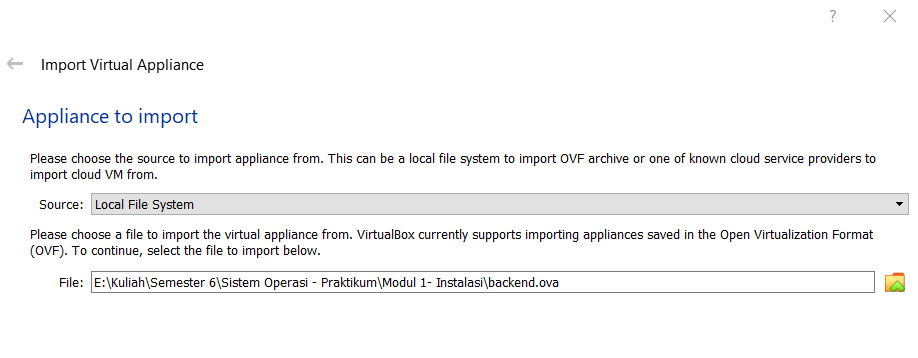
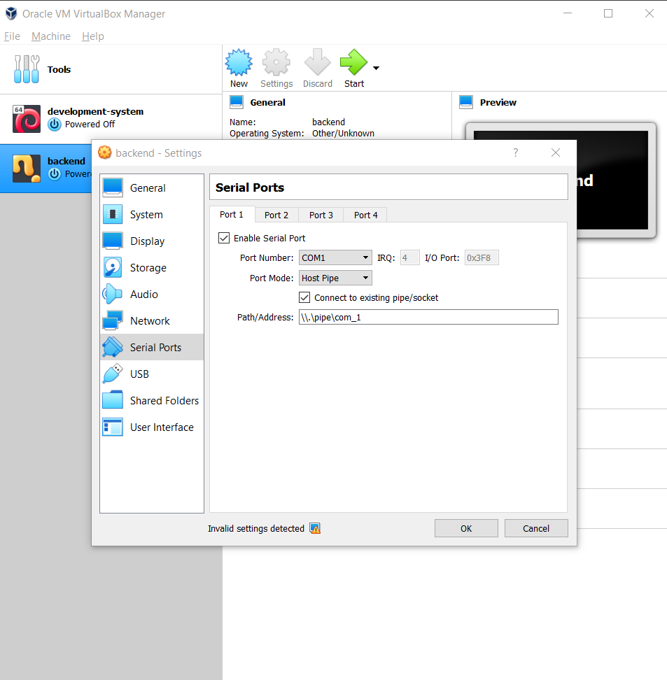

# <h1 align="center">Laporan Praktikum Modul 02  Instalasi Xinu</h1>

Rifki Taufikurrohman - 2311104033

## Dasar Teori

Oracle VM VirtualBox adalah perangkat lunak virtualisasi yang membuat pengguna menjalankan sistem operasi lain di dalam sistem operasi utama tanpa perlu melakukan instalasi ulang pada komputer. Dengan VirtualBox pengguna dapat membuat mesin virtual yang berfungsi seperti komputer terpisah di dalam satu perangkat fisik.

Xinu OS adalah sistem operasi sederhana yang dirancang khusus untuk tujuan pendidikan. Nama Xinu merupakan singkatan dari “Xinu Is Not Unix”. Sistem operasi ini digunakan untuk mempelajari konsep dasar sistem operasi seperti manajemen proses, manajemen memori, dan penjadwalan CPU. Xinu biasanya digunakan dalam perkuliahan Teknik Informatika atau Ilmu Komputer untuk memahami cara kerja kernel secara langsung.

## Guided

Pada Modul 2 berisi cara untuk menginstall Xinu OS, Tools yang dipakai adalah Oracle VM VirtualBox dan file <b>development-system.ova</b> dan <b> backend.ova.</b>

### Langkah-langkah import dan Setting Development-System VM: 
1. Import file development system ke VirtualBox

2. Setelah diimpor masuk ke setting bagian serial ports dan ganti path nya dari <b>/tmp/xinu_serial</b> menjadi<b> \\.\pipe\com_1</b>

3. Masuk ke menu System dan pilih tab Processor, ganti Processornya dari <b>1 CPU</b> menjadi <b>2 CPU</b>

4. Masuk ke menu Display dan Ceklis enable 3D Acceleration

### Langkah-langkah Import dan Setting Backend VM: 
1. Import file Backend ke VirtualBox

2. Setelah diimpor masuk ke setting bagian serial ports dan ganti path nya dari <b>/tmp/xinu_serial</b> menjadi<b> \\.\pipe\com_1</b>

### Hasil Akhir : 
1. 

## Referensi

1. https://en.wikipedia.org/wiki/Xinu