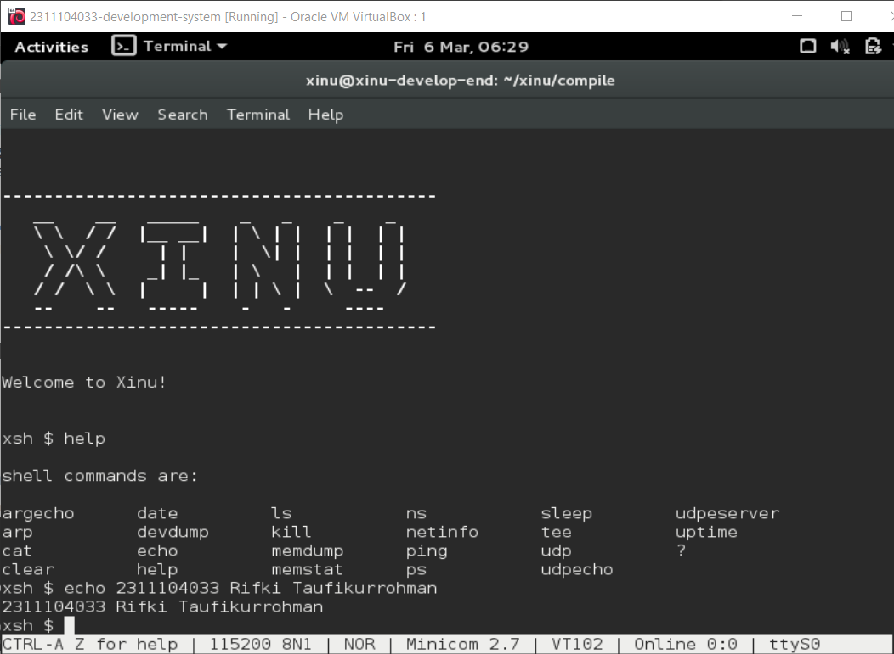

# <h1 align="center">Laporan Praktikum Modul 03   Explorasi Xinu</h1>

Rifki Taufikurrohman - 2311104033

## Dasar Teori

Xinu (merupakan akronim rekursif dari Xinu Is Not Unix) adalah sebuah sistem operasi berukuran kecil, elegan, dan terstruktur yang dikembangkan oleh Douglas Comer di Universitas Purdue pada awal 1980-an. Berbeda dengan sistem operasi komersial yang kompleks seperti Windows atau Linux, Xinu dirancang secara khusus untuk tujuan pendidikan dan penelitian. Tujuannya adalah untuk mendemonstrasikan bagaimana komponen-komponen inti dari sebuah sistem operasi (seperti manajemen memori, penjadwalan proses, dan antarmuka perangkat keras) dibangun dari awal.

## Guided

Pada Modul ini menjalankan terminal sistem operasi Xinu yang dijalankan melalui Oracle VM VirtualBox, selanjutnya menjalankan perintah `help` pada prompt `xsh`, sehingga sistem menampilkan daftar perintah shell yang tersedia seperti ls, ping, kill, sleep, udp, dan lainnya.

## Pertanyaan

1. Berapa jumlah perintah pada Xinu?  
   **Jawaban:** Xinu memiliki sekitar 24 perintah dasar yang dapat digunakan.

2. Sebutkan 2 perintah yang mempunyai fungsi yang sama!  
   **Jawaban:** Contoh dua perintah yang memiliki fungsi yang sama adalah `exit` dan `logout`. Kedua perintah tersebut digunakan untuk keluar dari shell atau mengakhiri sesi terminal yang sedang berjalan.

3. Berapa IP address Xinu?  
   **Jawaban:** IP address pada sistem Xinu biasanya adalah **192.168.1.2**. alamat IP dapat berbeda tergantung pada konfigurasi jaringan yang digunakan.

4. Perintah apa yang digunakan untuk mengetahui IP address?  
   **Jawaban:** Perintah yang digunakan untuk mengetahui IP address pada Xinu adalah `ifconfig`. 

5. Berapa IP DNS server yang digunakan oleh Xinu?  
   **Jawaban:** DNS server yang digunakan pada konfigurasi Xinu biasanya adalah **192.168.1.1**.

6. Terdapat berapa proses yang sedang berjalan pada Xinu?  
   **Jawaban:** Pada saat sistem Xinu dijalankan biasanya terdapat beberapa proses aktif, umumnya sekitar **10 proses**.

7. Proses apa yang mempunyai prioritas paling rendah?  
   **Jawaban:** Proses yang memiliki prioritas paling rendah pada Xinu adalah **Null process**.

8. Proses apa yang mempunyai ukuran paling besar?  
   **Jawaban:** Proses yang memiliki ukuran memori paling besar biasanya adalah **Main process**. Hal ini karena proses utama memuat berbagai fungsi penting yang digunakan untuk menjalankan sistem dan memulai proses lainnya.

9. Proses apa yang berada dalam state current?  
   **Jawaban:** Proses yang berada pada state **current** adalah proses yang sedang dijalankan oleh CPU pada saat itu. Pada kondisi awal sistem, proses yang berada pada state ini biasanya adalah **Main process**.

10. Proses apa yang berada dalam state suspend?  
    **Jawaban:** Proses yang berada dalam state **suspend** adalah proses yang sedang dihentikan sementara dan tidak dijalankan oleh CPU. Contoh proses yang sering berada pada state ini adalah **Shell**, yang menunggu perintah dari pengguna.

11. Berapa PID (Process ID) dari Main process?  
    **Jawaban:** PID dari **Main process** pada sistem Xinu biasanya adalah **1**. PID digunakan oleh sistem operasi untuk mengidentifikasi setiap proses yang sedang berjalan secara unik.

## Referensi

1. https://medium.com/@einstenkhaled/eksplorasi-xinu-kompilasi-booting-pxe-dan-memahami-mekanisme-shell-dari-sudut-sistem-operasi-e3444aea1883 