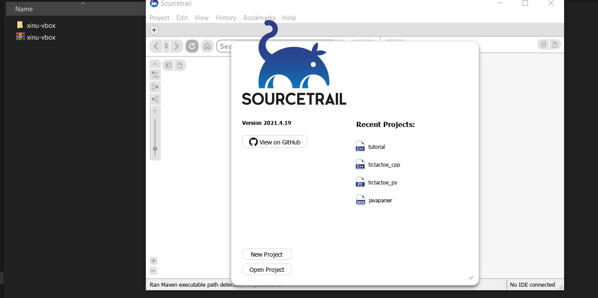
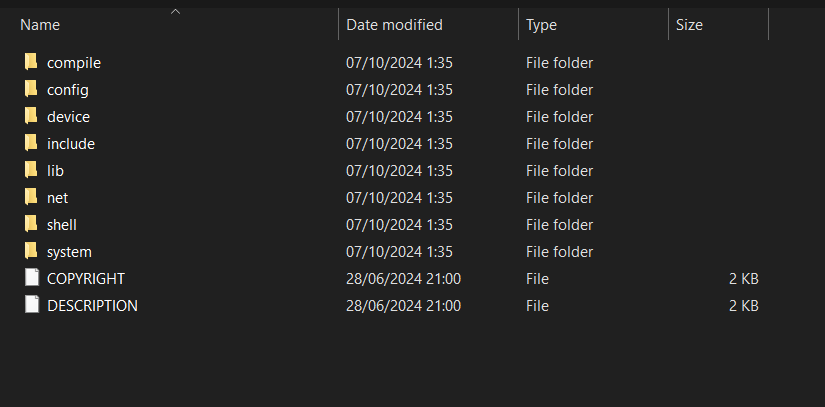
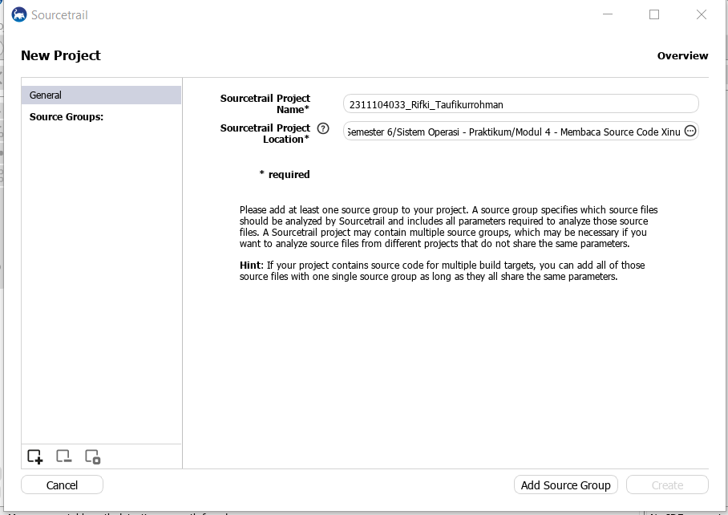
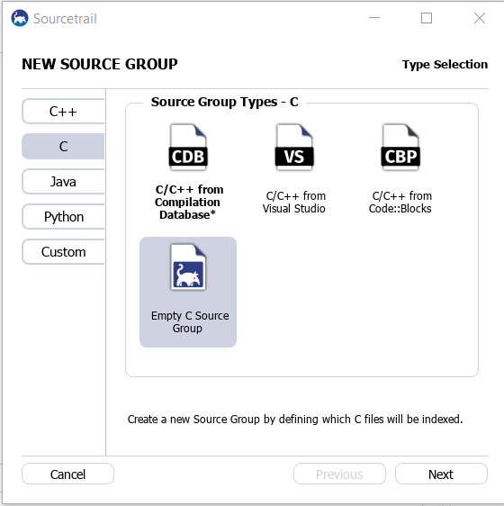
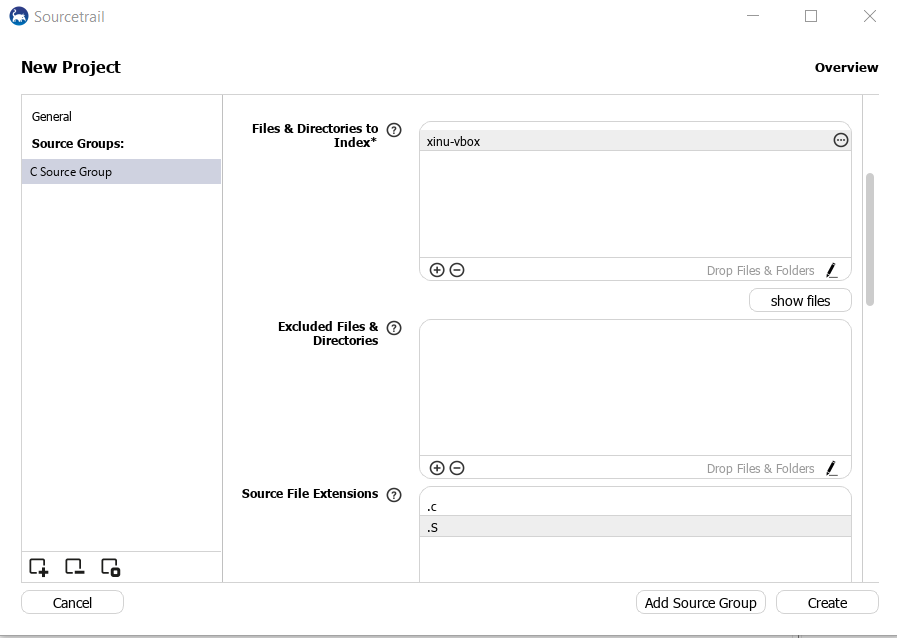
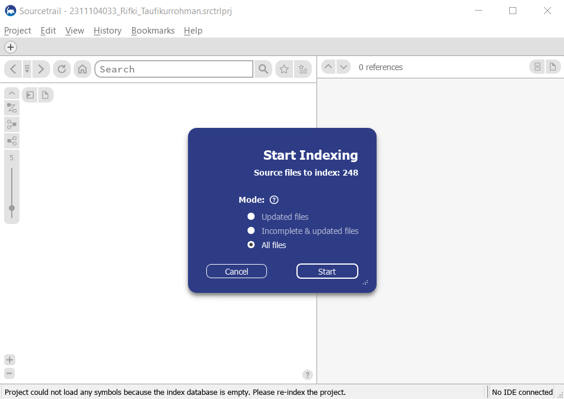
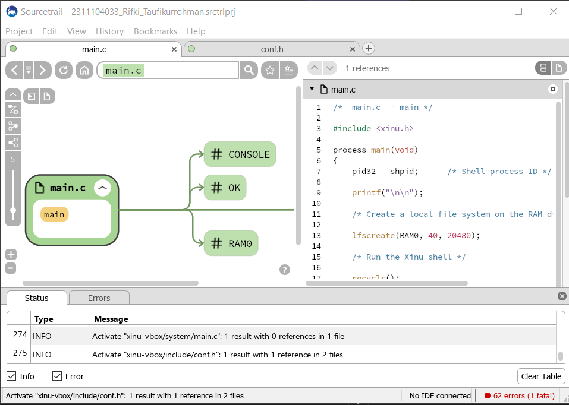
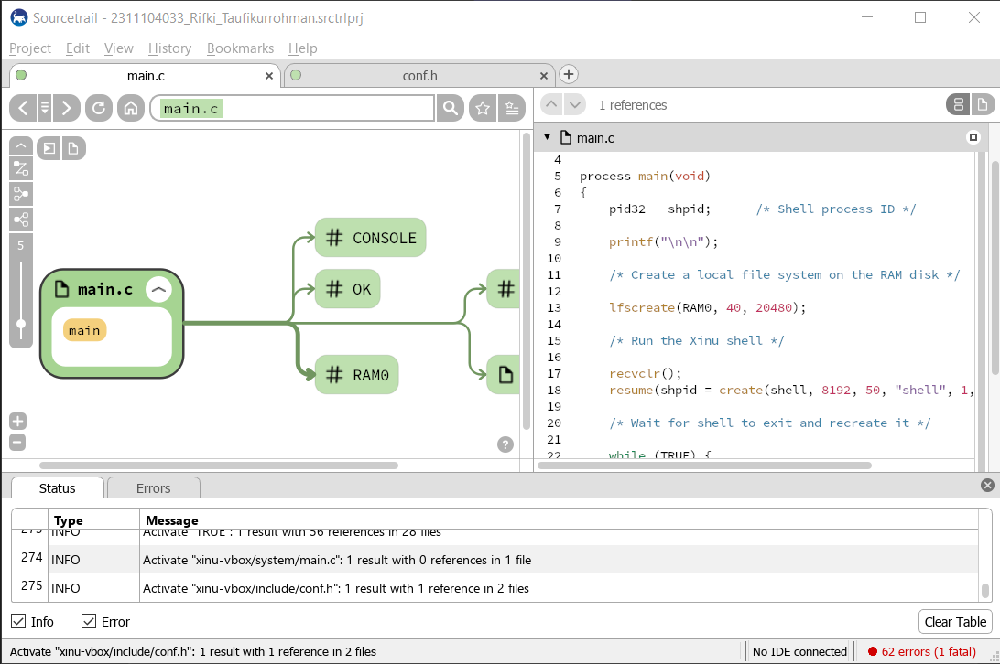
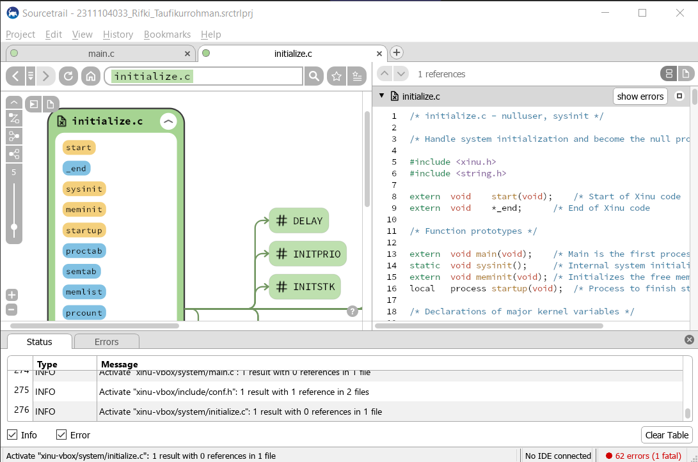
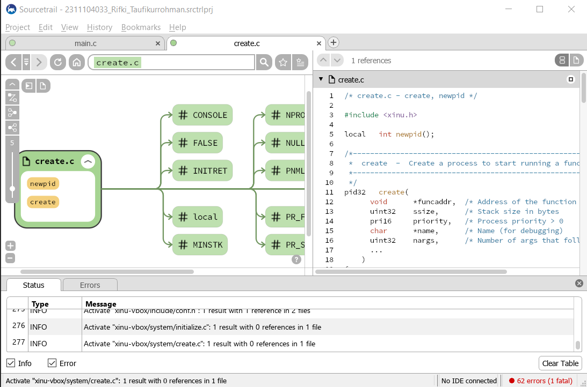

# <h1 align="center">Laporan Praktikum Modul 04   Membaca Source Code Xinu</h1>

Rifki Taufikurrohman - 2311104033

## Dasar Teori

Sistem operasi Xinu dirancang untuk berjalan pada sistem embedded, yaitu sistem komputer yang dibuat khusus untuk menjalankan fungsi tertentu pada perangkat keras tertentu seperti router, mikrokontroler, atau perangkat jaringan. Dalam pengembangannya, Xinu menggunakan paradigma cross-development, yaitu proses pengembangan perangkat lunak yang dilakukan pada komputer pengembang (host) seperti PC atau laptop dengan sistem operasi umum seperti Linux atau Windows. Pada komputer tersebut, programmer menulis kode program, melakukan proses kompilasi, dan menghasilkan sebuah file img/image yang berisi sistem operasi lengkap. File img/image tersebut kemudian dipindahkan ke perangkat target (embedded system) melalui media seperti jaringan, USB, atau kabel serial, dan selanjutnya dijalankan pada perangkat tersebut.

Bahasa pemrograman utama yang digunakan dalam pengembangan Xinu adalah bahasa C. Bahasa C dipilih karena memiliki kemampuan low-level programming, yaitu mampu berinteraksi langsung dengan perangkat keras seperti memori, register, dan perangkat input-output. Selain itu, bahasa C juga memiliki efisiensi tinggi dan portabilitas yang baik sehingga banyak digunakan dalam pengembangan sistem operasi lain seperti Unix, Linux, dan MacOS. Dengan menggunakan bahasa C, pengembang dapat mengontrol sumber daya sistem secara lebih efektif sekaligus menjaga performa sistem operasi tetap ringan dan cepat, yang sangat penting dalam lingkungan sistem embedded.

## Guided

### 1. Siapkan Source Trail dan Xinu vbox

### 2. Extract Xinu vbox

### 3. Buat Project di SourceTrail dengan format NIM_Nama

### 4. Pilih Source Group Bahasa C dan pilih lagi Empty C Source Group

### 5. Tambahkan Files & Directories to Index folder `xinu-vbox` yang sudah di ekstrak dan tambahkan Source File Extension `.S`

### 6. Mulai Indexing

### 7. Xinu Sudah Terbaca di SourceTrail

## Explorasi Source Code Xinu
### 1. `main.c `
File ini merupakan titik awal eksekusi sistem operasi Xinu. Di dalamnya terdapat fungsi main() yang melakukan inisialisasi awal sistem seperti membuat file system pada RAM dan menjalankan shell Xinu.

### 2. `initialize.c`
File ini berisi proses inisialisasi komponen utama sistem operasi, seperti pengaturan tabel proses, inisialisasi perangkat, memori, serta struktur data yang diperlukan sebelum sistem mulai berjalan.

### 3. `create.c` 
File ini digunakan untuk membuat proses baru pada Xinu. Fungsi di dalamnya akan mengalokasikan stack, mengatur atribut proses, dan memasukkan proses tersebut ke dalam tabel proses.

