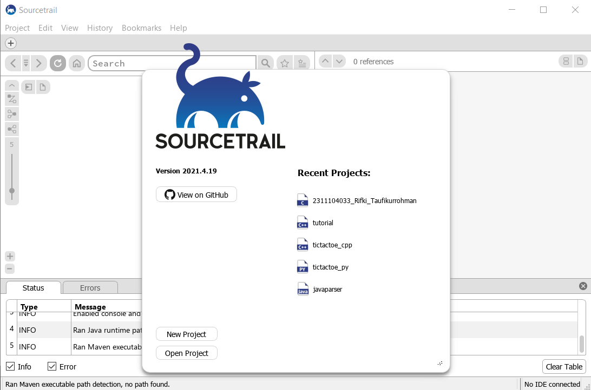
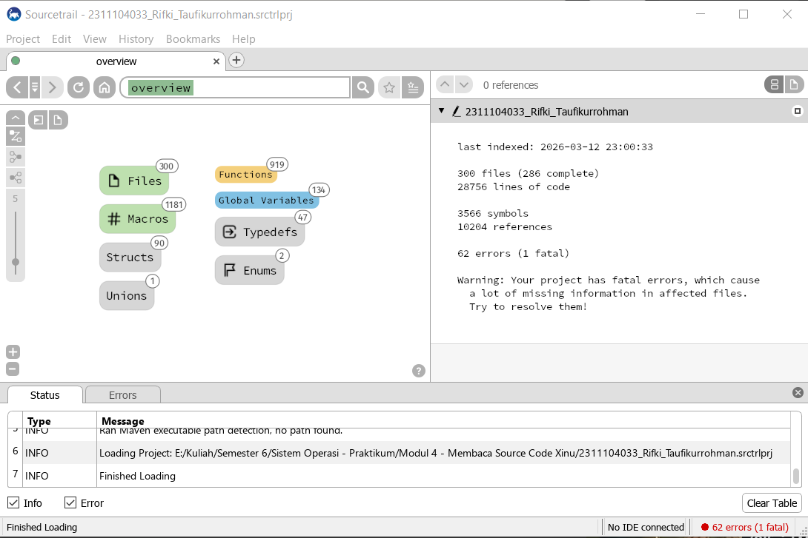
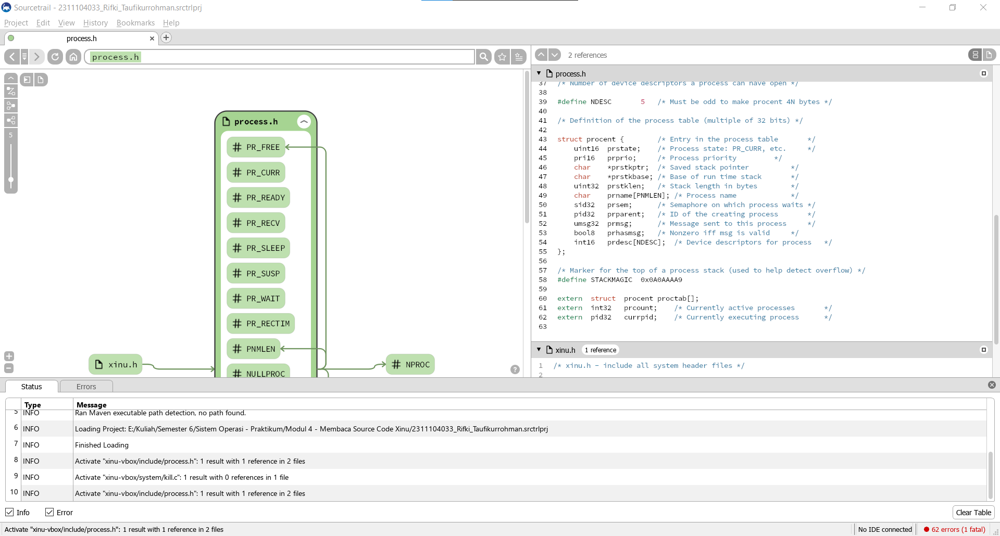
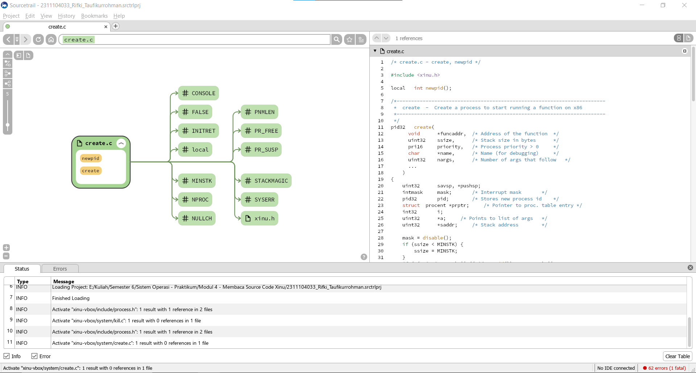
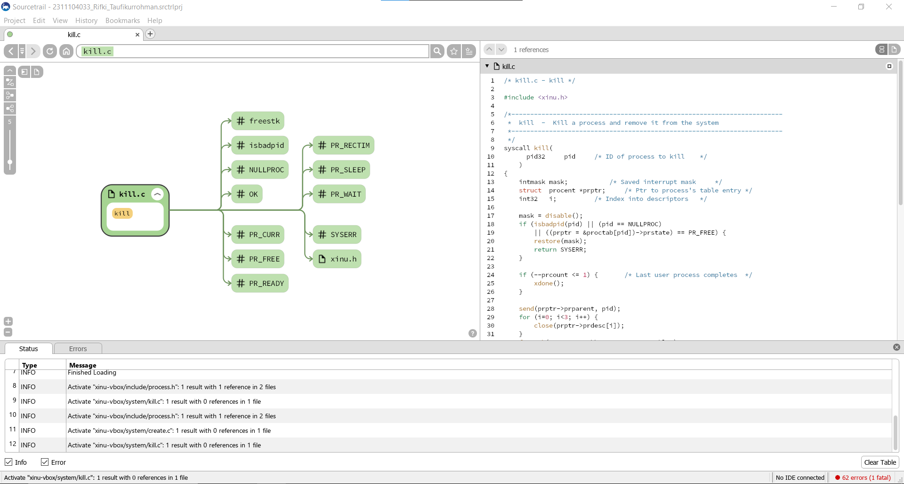
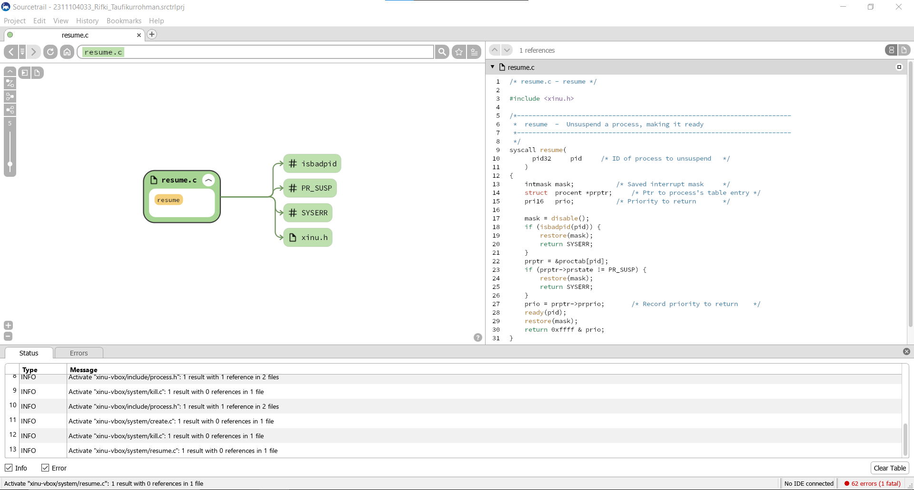

# <h1 align="center">Laporan Praktikum Modul 05   Eksplorasi Proses Xinu </h1>

Rifki Taufikurrohman

## Dasar Teori

Sistem operasi merupakan perangkat lunak yang berfungsi sebagai pengelola sumber daya komputer serta penghubung antara perangkat keras dan pengguna. Salah satu konsep utama dalam sistem operasi adalah proses, yaitu program yang sedang dieksekusi. Proses memiliki beberapa komponen penting seperti program counter, register CPU, stack, dan ruang memori yang digunakan selama eksekusi berlangsung.

Dalam konteks pembelajaran sistem operasi, Xinu Operating System (eXtensible, Interactive, Unix-like Operating System) digunakan sebagai sistem operasi sederhana yang dirancang untuk tujuan edukasi. Xinu memungkinkan mahasiswa memahami konsep dasar seperti manajemen proses, penjadwalan (scheduling), dan komunikasi antar proses secara lebih mendalam karena strukturnya yang relatif sederhana dibanding sistem operasi modern.

Pada Xinu, setiap proses direpresentasikan dalam sebuah struktur data yang disebut Process Control Block (PCB). PCB menyimpan informasi penting seperti ID proses (PID), status proses, prioritas, stack pointer, serta konteks CPU. Status proses dalam Xinu umumnya meliputi running, ready, waiting, dan suspended. Perubahan status ini terjadi berdasarkan mekanisme penjadwalan yang diterapkan oleh sistem operasi.

## Guided

### 1. Siapkan Source Trail 

### 2. Buka Project Sebelumnya pada Modul 04

### 3. proses.h yang berisi konfigurasi setiap proses pada Xinu. 

### 4. create.c untuk membuat proses.

### 5. kill.c untuk terminasi proses.

### 6. resume.c untuk resume proses. 
