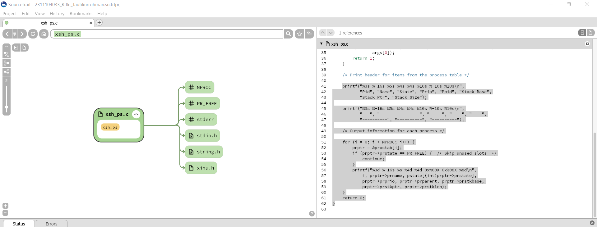
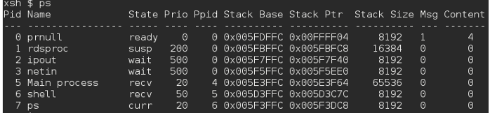
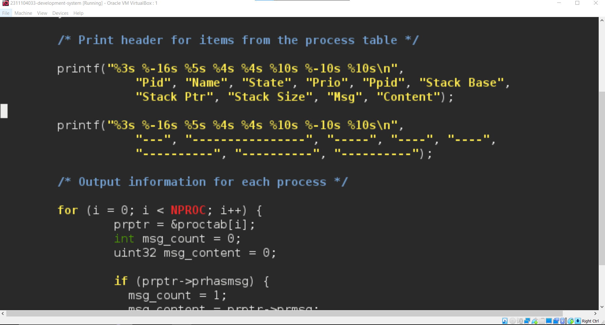
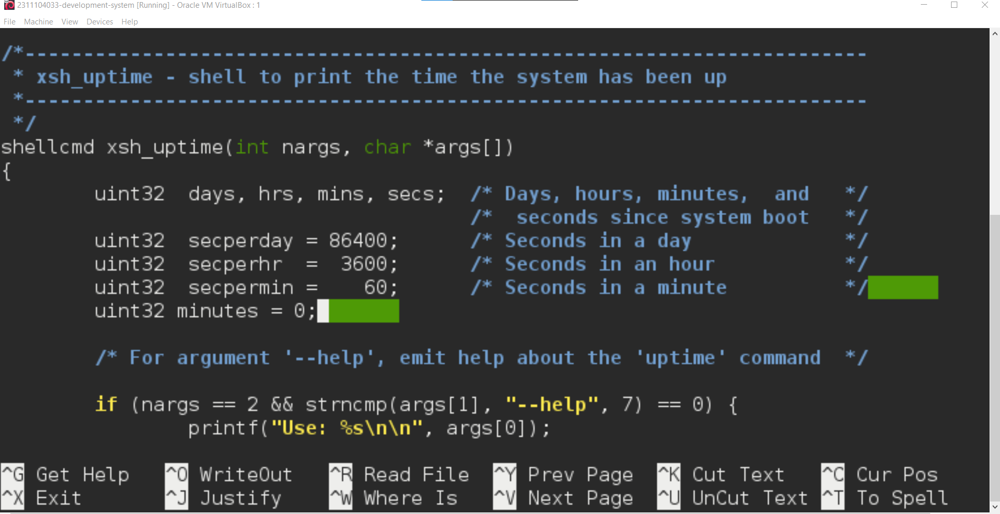
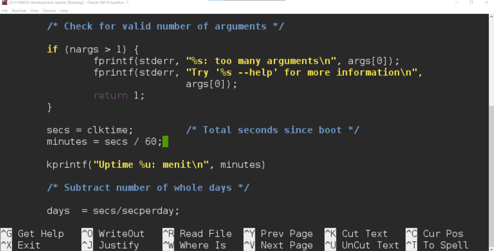

# <h1 align="center">Laporan Praktikum Modul 05   Eksplorasi Proses Xinu </h1>

Rifki Taufikurrohman

## Dasar Teori

Sistem operasi merupakan perangkat lunak yang berfungsi sebagai pengelola sumber daya komputer serta penghubung antara perangkat keras dan pengguna. Salah satu konsep utama dalam sistem operasi adalah proses, yaitu program yang sedang dieksekusi. Proses memiliki beberapa komponen penting seperti program counter, register CPU, stack, dan ruang memori yang digunakan selama eksekusi berlangsung.

Dalam konteks pembelajaran sistem operasi, Xinu Operating System (eXtensible, Interactive, Unix-like Operating System) digunakan sebagai sistem operasi sederhana yang dirancang untuk tujuan edukasi. Xinu memungkinkan mahasiswa memahami konsep dasar seperti manajemen proses, penjadwalan (scheduling), dan komunikasi antar proses secara lebih mendalam karena strukturnya yang relatif sederhana dibanding sistem operasi modern.

Pada Xinu, setiap proses direpresentasikan dalam sebuah struktur data yang disebut Process Control Block (PCB). PCB menyimpan informasi penting seperti ID proses (PID), status proses, prioritas, stack pointer, serta konteks CPU. Status proses dalam Xinu umumnya meliputi running, ready, waiting, dan suspended. Perubahan status ini terjadi berdasarkan mekanisme penjadwalan yang diterapkan oleh sistem operasi.

## Guided

### 1. Siapkan Source Trail 

### 2. Buka Project Sebelumnya pada Modul 04

### 3. proses.h yang berisi konfigurasi setiap proses pada Xinu. 

### 4. create.c untuk membuat proses.

### 5. kill.c untuk terminasi proses.

### 6. resume.c untuk resume proses. 

## Jurnal

### 1. Jawablah pertanyaan berikut ini:   
**a. Berapa banyaknya maksimum proses yang ada pada Xinu ?**

**b. Berapa maksimal panjang nama suatu proses pada Xinu ?** 

**c. Berapa nilai prioritas awal pada saat proses dibuat ?** 

**d. Ada berapa total state pada Xinu? Sebutkan !** 

Jawab : 
a. 50 Proses 

b. 16 Karakter 

c. Ditentukan oleh parameter yang diberikan saat pemanggilan create() ``contoh: create(func, stack, priority, name, nargs, args);``

d. 7 state, yaitu:
- PR_FREE → slot proses kosong
- PR_CURR → sedang berjalan 
- PR_READY → siap dijalankan 
- PR_RECV → menunggu pesan 
- PR_SLEEP → sedang tidur 
- PR_SUSP → ditangguhkan 
- PR_WAIT → menunggu resource 

### 2. Perintah ps adalah perintah untuk menampilkan statistik process yang berjalan. Source code dari ps tersimpan pada file xsh_ps.c. Carilah file tersebut dan beri komentar pada 20 baris terakhir di source code tersebut! 

Jawab : 

### 3. Ubahlah perintah ps (source code: xsh_ps.c) pada Xinu sehingga menampilkan informasi tambahan berupa kolom yang berisi total message yang ada pada proses seperti gambar di bawah ini: 

### Kolom Msg adalah banyaknya pesan yang ada dalam proses. Kolom Content adalah isi dari pesan tersebut. Langkah pengerjaan: 
### • Modifikasi source code pada file xsh_ps.c 
### • Kompilasi ulang Xinu dengan perintah seperti pada modul sebelumnya  
### • Jalankan Backend VM  
### • Setelah sistem berjalan, jalankan perintah $ps. Pastikan hasilnya sesuai dengan contoh output pada gambar yang diberikan. 
### • Screenshot source kode dan output akhir hasil modifikasi 

Jawab : 

### 4.  Ubahlah perintah uptime pada Xinu sehingga menampilkan lamanya Xinu sejak booting hanya dalam satuan menit. Langkah pengerjaan: 
### • Kompilasi ulang Xinu dengan perintah seperti pada modul sebelumnya  
### • Jalankan Backend VM  
### • Setelah sistem berjalan, jalankan perintah $uptime. Pastikan hasilnya sesuai dengan contoh output yang diinginkan 
### • Screenshot source kode dan output akhir hasil modifikasi

Jawab : 

