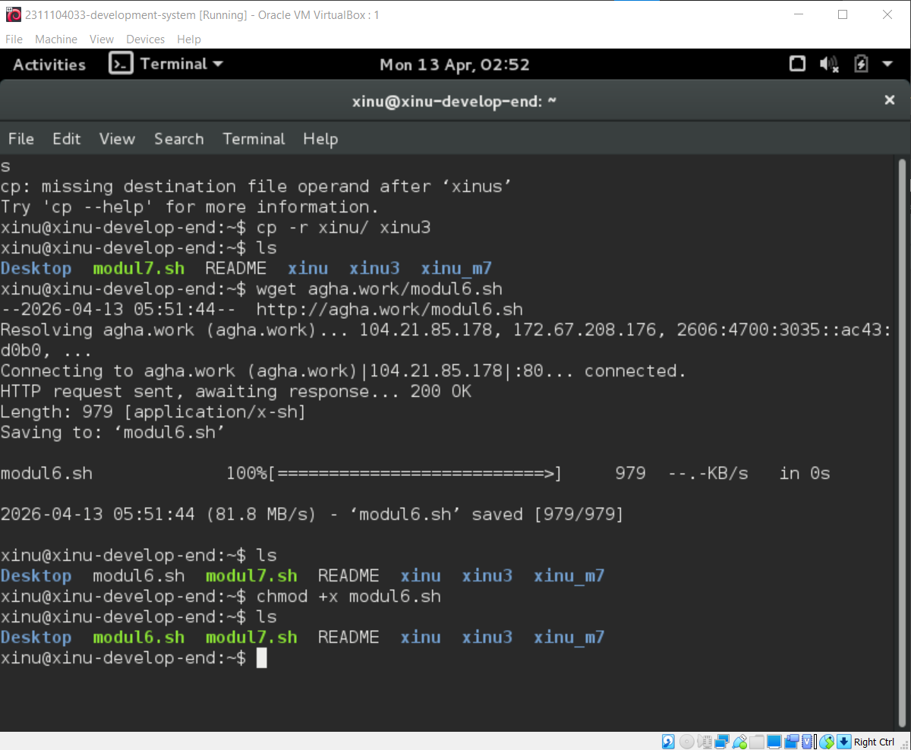
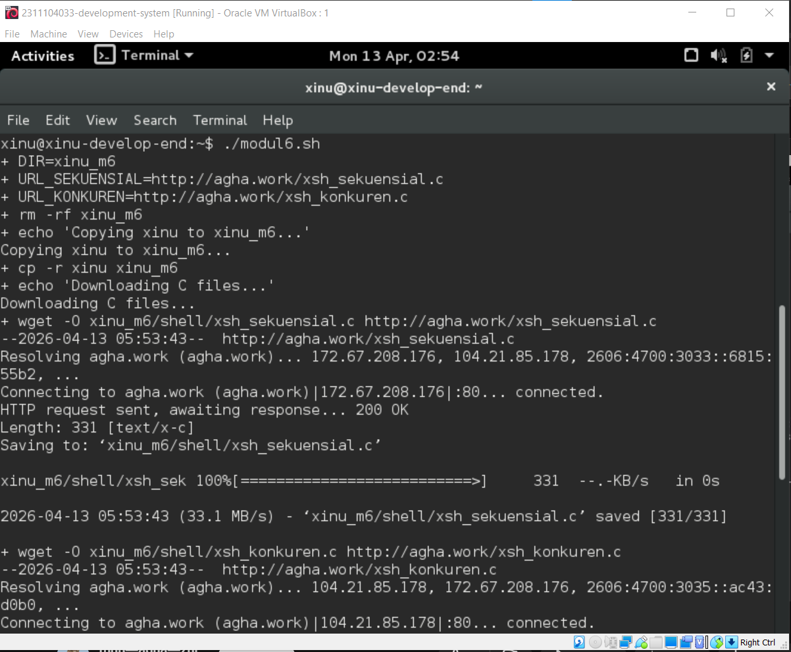
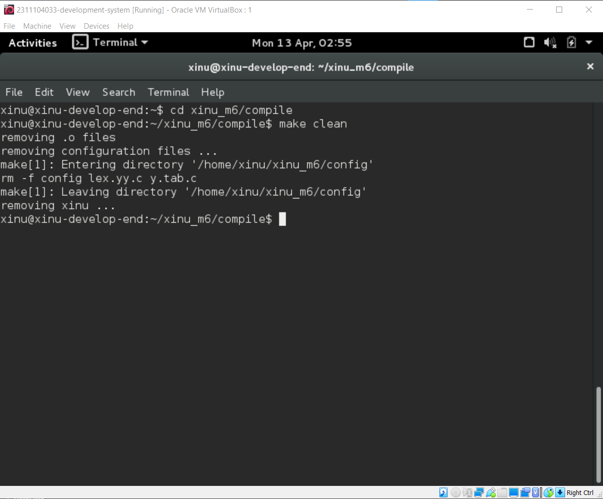
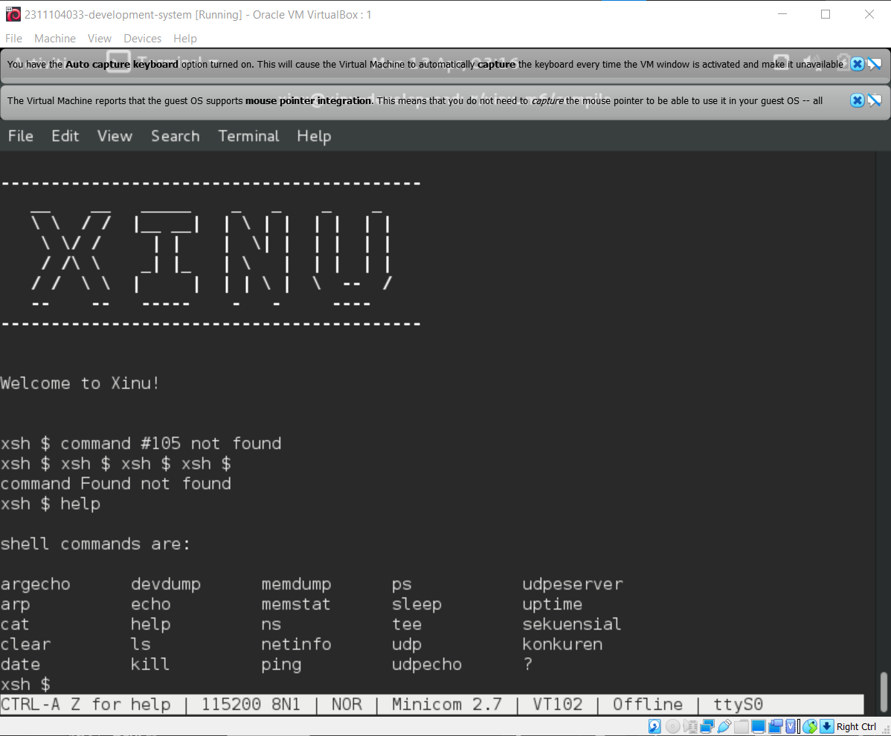
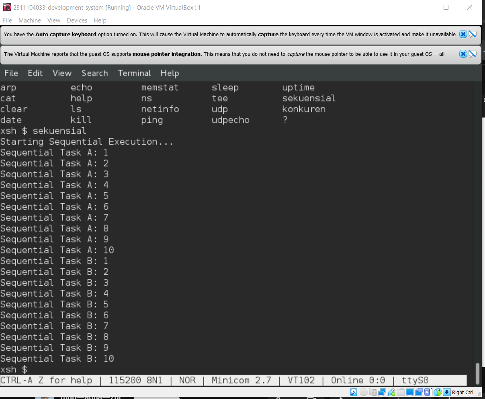
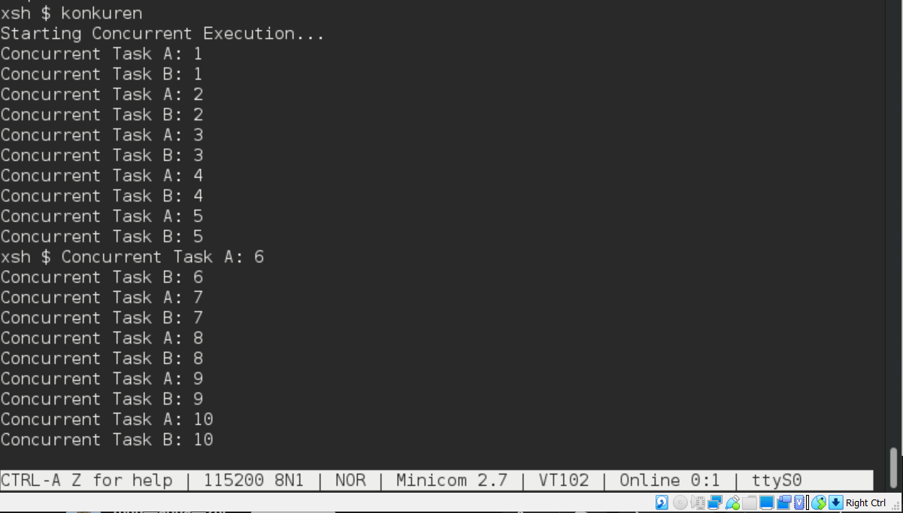
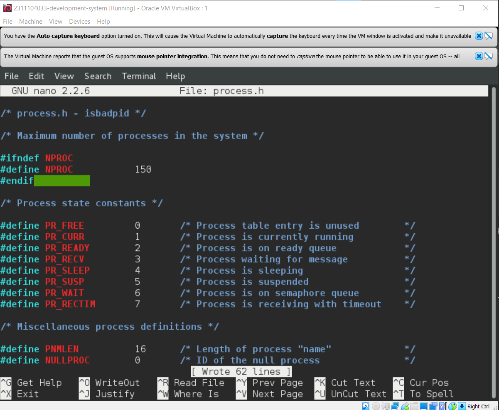
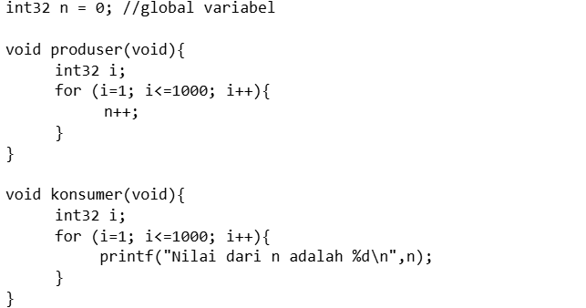

# <h1 align="center">Laporan Praktikum Modul 06  Sekuensial dan Konkuren</h1>

Rifki Taufikurrohman - 2311104033

## Dasar Teori

Dalam sistem operasi, konsep eksekusi program dapat dipahami melalui dua pendekatan utama yaitu sekuensial dan konkuren. Secara sekuensial, program dijalankan secara berurutan, di mana setiap instruksi dieksekusi satu per satu sesuai urutan penulisan, sehingga pada satu waktu hanya ada satu proses yang aktif. Namun, untuk meningkatkan efisiensi dan pemanfaatan sumber daya, sistem operasi modern menerapkan konsep konkuren (concurrent processing), yaitu kemampuan menjalankan beberapa proses secara bersamaan. Pada sistem dengan satu CPU, hal ini dicapai melalui teknik multitasking atau interleaving, di mana CPU berpindah-pindah dengan sangat cepat antar proses sehingga menimbulkan ilusi eksekusi simultan, sedangkan pada sistem multicore dapat terjadi paralelisme nyata. Selain itu, terdapat dua jenis multitasking, yaitu timesharing yang membagi waktu CPU secara merata untuk setiap proses, dan realtime yang memberikan prioritas khusus pada proses tertentu agar memenuhi kebutuhan waktu yang ketat. Konsep ini menjadi dasar penting dalam pengelolaan proses pada sistem operasi agar kinerja sistem tetap optimal dan responsif.

## Guided

  

  

  

  

  

  

## Jurnal

### Soal
1. Selain hardware (memory), batasan maksimal proses dapat ditentukan dengan secara software.  Pada Linux maksimal proses adalah 4194303 proses (64 bit) dan 32767 proses (32 bit) dapat dilihat melalui perintah $cat /proc/sys/kernel/pid_max 

    Carilah pada source code Xinu yang memberi batasan mengenai banyaknya proses yang bisa dibuat! Berapa maksimal proses dalam Xinu?  Ubah menjadi maksimal 150 proses! 

    Jawab : 

2.  Jalankan kode sekuensial! 

    Jawab : 

3. Jalankan kode konkuren!

    Jawab : 

4. Buatlah 2 proses produser dan konsumer. Produser memproduksi angka integer dari 1-1000. Konsumer mengkonsumsi integer yang diproduksi oleh produser dan menampilkannya! (Gunakan variabel global bertipe int32 bernama n yang digunakan secara bersama oleh kedua proses)

    

    Hasil dari program ini cukup mengejutkan (tidak akan sesuai dengan intuisi awal). Jelaskan mengapa hasilnya seperti itu!

    Jawab : Penjelasan Mengapa Hasilnya "Mengejutkan":
    Hasilnya tidak akan sesuai intuisi (kita mungkin mengira n akan selalu tercetak urut 1 sampai 1000) karena terjadi fenomena Race Condition (Kondisi Balapan).

    Shared Resource Tanpa Proteksi: Kedua proses mengakses variabel global n yang sama secara bersamaan tanpa adanya mekanisme sinkronisasi (seperti Semaphore).

    Interupsi Scheduler: Xinu menggunakan preemptive scheduling. Di tengah-tengah proses produser menaikkan nilai n (misal dari 5 ke 6), CPU bisa saja mengalihkan tugas ke konsumer.

    Ketidakkonsistenan: Konsumer mungkin mencetak nilai n yang sama berulang kali (jika produser belum sempat jalan), atau melompati banyak angka (jika produser berjalan lebih cepat sebelum konsumer sempat mencetak).

    Operasi Non-Atomik: Instruksi n++ di tingkat bahasa mesin terdiri dari tiga langkah: Load (ambil nilai), Increment (tambah 1), dan Store (simpan kembali). Jika perpindahan proses terjadi di sela-sela langkah ini, nilai akhir n bahkan bisa tidak mencapai 1000.