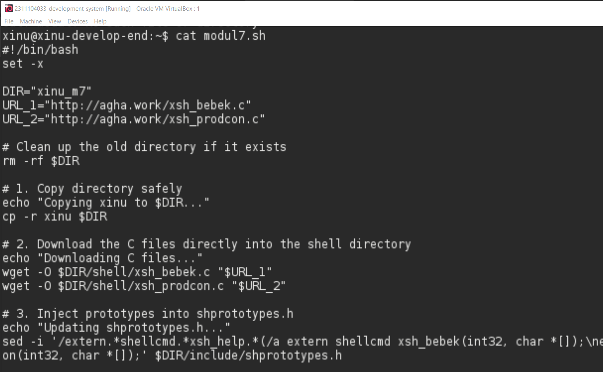
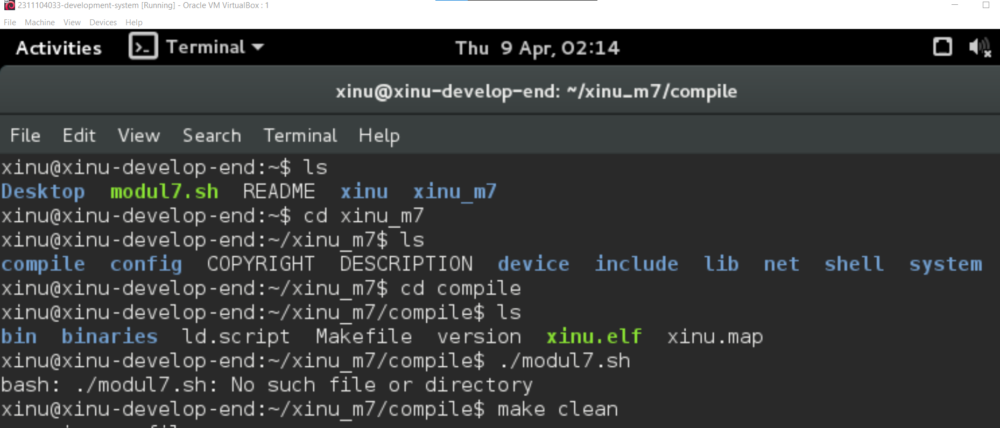
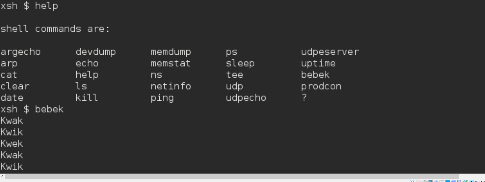
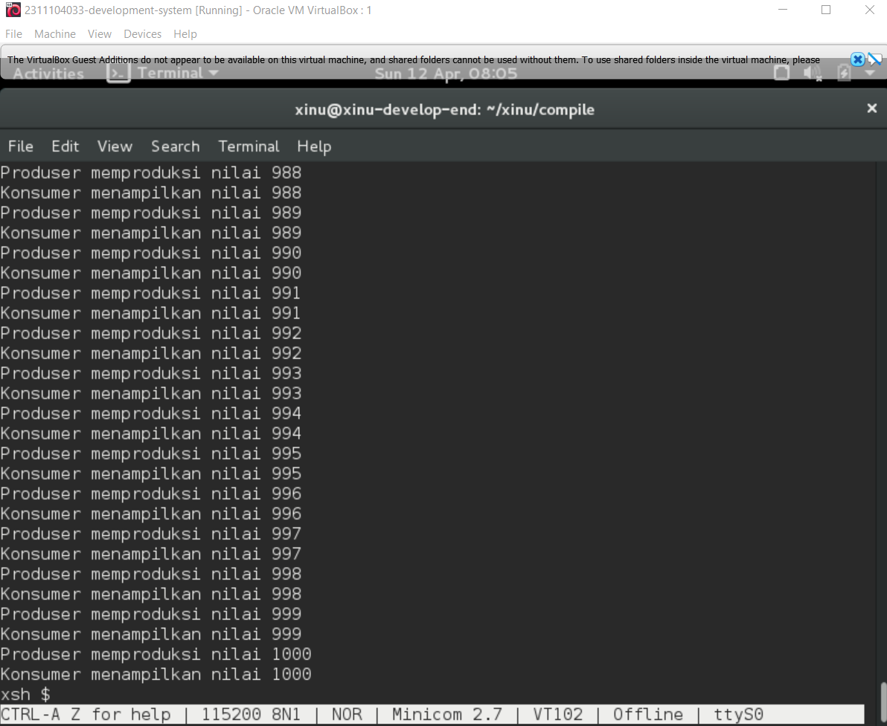

# <h1 align="center">Laporan Praktikum Modul 07   Semaphore</h1>

Rifki Taufikurrohman - 2311104033

## Dasar Teori

### Operasi Semaphore

Terdapat 3 operasi yang bisa dilakukan pada semaphore yaitu: inisiasi, signal dan wait

### Inisiasi 

Pada Xinu, inisiasi semaphore dilakukan sebagai berikut:
>`nama_semaphore = semcreate(nilai_inisiasi_semaphore)`

### Signal

Signal berarti increment nilai semaphore. Pada Xinu, semaphore signal menggunakan sintak sebagai 
berikut:
> `signal(nama_semaphore)`

### Wait
 berarti decrement nilai semaphore. Jika bernilai negatif maka proses yang memanggil wait akan 
block (perintah setelah wait akan dieksekusi setelah proses diunblock). Pada Xinu, semaphore wait 
menggunakan sintak sebagai berikut:
>`wait(nama_semaphore)`

## Guided
mulai dengan mengunduh shell script bernama modul7.sh menggunakan perintah wget. Setelah file terunduh, jalankan perintah chmod +x modul7.sh untuk memberikan izin eksekusi agar script tersebut bisa dijalankan. Jika dicek menggunakan perintah cat, script ini bekerja secara otomatis untuk menduplikasi folder sistem operasi xinu menjadi xinu_m7. Kemudian, script akan mengunduh dua file program C kustom (xsh_bebek.c dan xsh_prodcon.c) dan menyimpannya langsung ke dalam folder shell Xinu. Script ini juga bertugas menambahkan fungsi program tersebut ke dalam file shprototypes.h agar perintah barunya dikenali oleh sistem.

Setelah script selesai bekerja, langkah selanjutnya adalah masuk ke dalam direktori kompilasi dengan mengetik cd xinu_m7/compile. Di dalam folder ini, jalankan perintah make clean untuk menghapus sisa file kompilasi sebelumnya agar sistem bisa di-build ulang dengan bersih. Setelah OS Xinu berhasil dikompilasi dan dijalankan, kita bisa memverifikasinya dengan mengetik help di dalam Xinu shell (xsh). Di sana, perintah bebek dan prodcon sudah muncul dan siap digunakan. Terakhir, tinggal ketik perintah bebek untuk mengujinya, dan program akan merespons dengan memunculkan output berupa teks "Kwak", "Kwik", "Kwek", dan seterusnya di layar.

## Jurnal

### Soal

1. Buatlah 3 buah proses yaitu P1, P2 dan P3. P1 selalu  menampilkan “kwak”, P2 selalu menampilkan “kwik”, P3 selalu menampilkan “kwek”. Menggunakan 3 proses tersebut dan beberapa buah semaphore, buatlah program yang dapat menampilkan: Kwak Kwik Kwek Kwak Kwik Kwek

    jawab : 

2. Buatlah proses bernama produser yang memproduksi bilangan 1-1000. Buatlah proses bernama konsumer yang akan menampilkan nilai yang diproduksi oleh produser. Gunakan semaphore! Produser memproduksi nilai 1
Konsumer menampilkan nilai 1
Produser memproduksi nilai 2
Konsumer menampilkan nilai 2
….
Produser memproduksi nilai 1000
Konsumer menampilkan nilai 1000

    jawab : 

