# <h1 align="center">Laporan Praktikum Modul 09  Syscall Xinu</h1>

Rifki Taufikurrohman - 2311104033

## Dasar Teori

System call (syscall) merupakan mekanisme antarmuka yang disediakan oleh sistem operasi untuk memungkinkan proses pengguna (user process) berinteraksi dengan kernel. Melalui syscall, suatu proses dapat meminta layanan tertentu dari sistem operasi, seperti manajemen memori, pengelolaan proses, maupun operasi input/output. Syscall juga berperan penting dalam menjaga keamanan dan prinsip information hiding, karena proses tidak perlu mengetahui detail implementasi internal kernel. Proses hanya perlu memanggil syscall yang diinginkan, kemudian kernel akan mengeksekusi permintaan tersebut dan mengembalikan hasil berupa status berhasil atau gagal. Hal ini membedakan syscall dengan fungsi biasa yang dibuat oleh developer, seperti printf(), karena syscall melibatkan transisi dari mode user ke mode kernel.

Pada sistem operasi Xinu, mekanisme kerja syscall dirancang untuk menjamin konsistensi dan keamanan sistem. Ketika syscall dipanggil, langkah pertama yang dilakukan adalah menonaktifkan (disable) seluruh interupsi. Tujuannya adalah untuk memastikan bahwa tidak terjadi perubahan terhadap struktur data global secara bersamaan oleh proses lain, sehingga kondisi sistem tetap konsisten. Selain itu, penonaktifan interupsi juga mencegah terjadinya context switching selama syscall berlangsung, sehingga eksekusi tidak terganggu.

Setelah itu, kernel akan memeriksa seluruh argumen yang diberikan oleh proses pemanggil (caller). Syscall tidak boleh mengasumsikan bahwa input dari proses selalu valid, sehingga setiap parameter akan diverifikasi terlebih dahulu, termasuk kesesuaian tipe data dan hak akses. Jika ditemukan argumen yang tidak valid atau tidak memiliki izin, maka permintaan syscall akan ditolak. Tahap berikutnya adalah mengeksekusi layanan yang diminta, yang merupakan fungsi utama dari syscall, seperti membebaskan memori atau menunda eksekusi proses.

## Guided
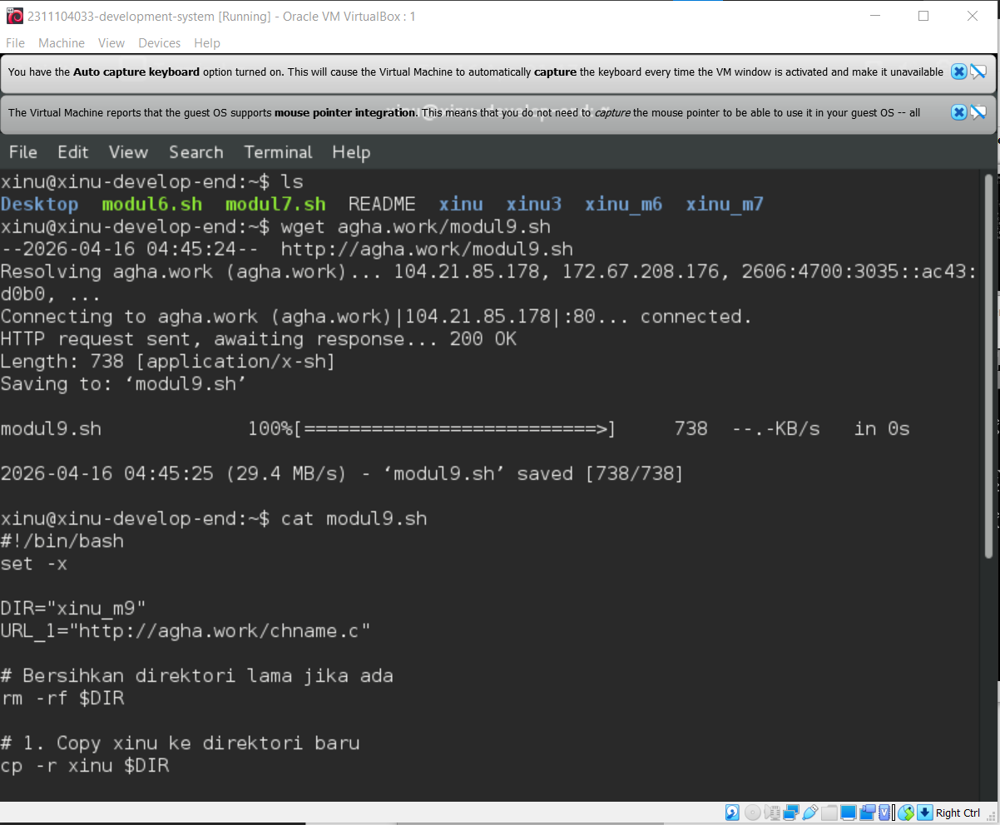

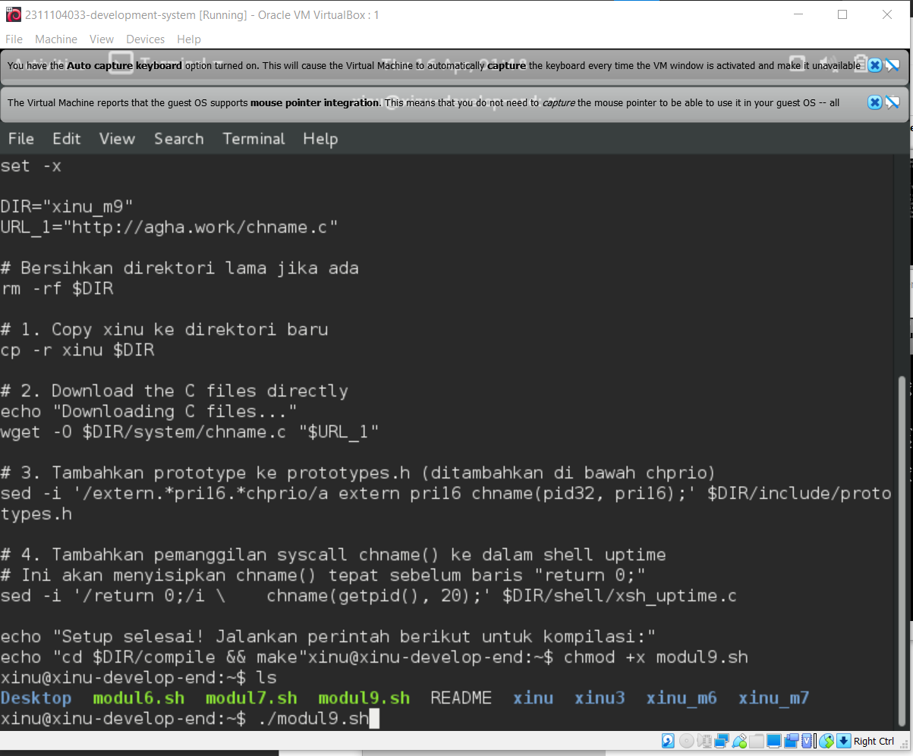

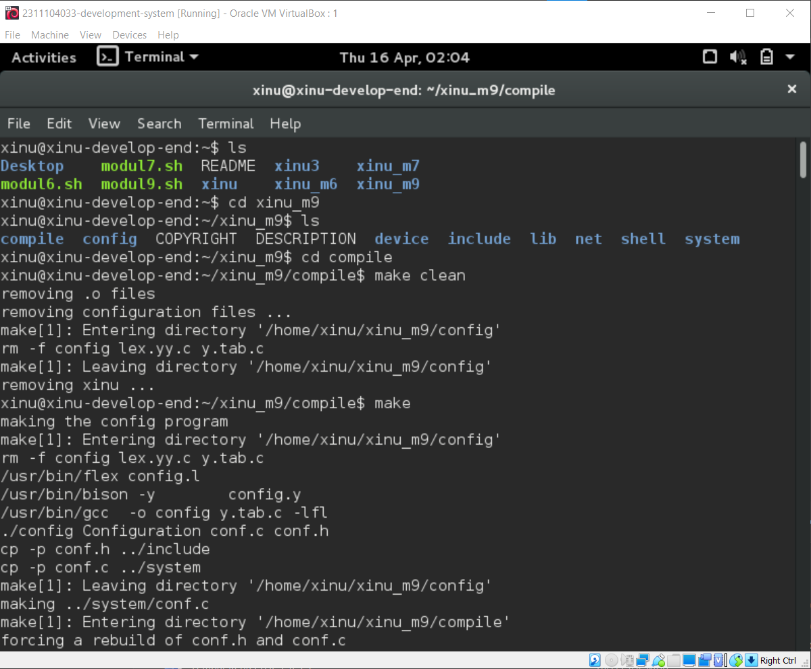

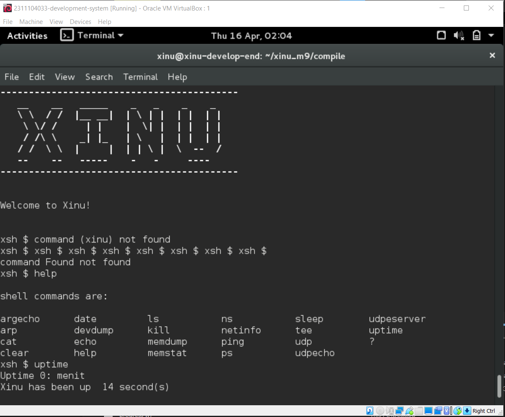

## Jurnal

Jawaban Nomor 1 : 
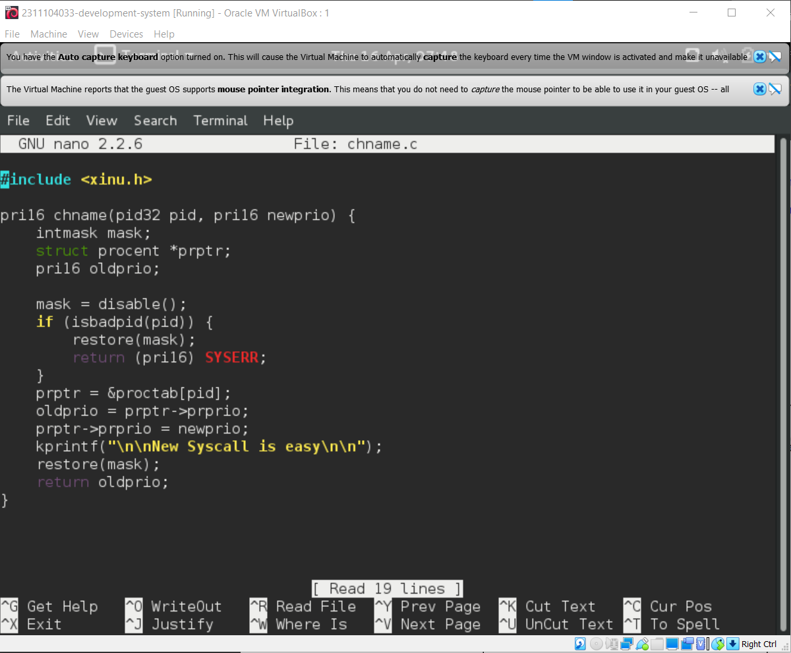

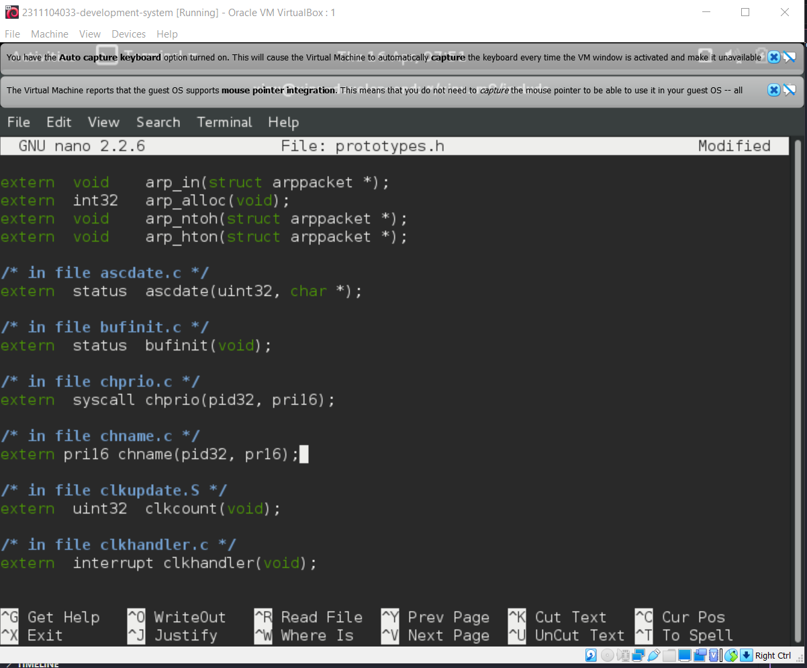

Jawaban Nomor 2 : 
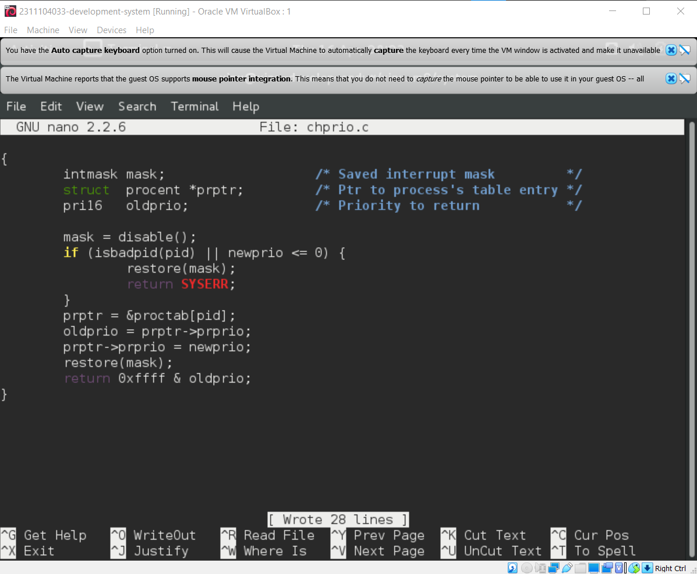

Jawaban Nomor 3 : 
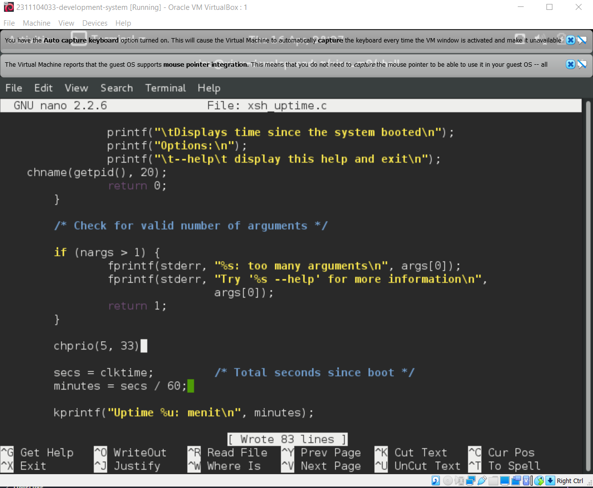

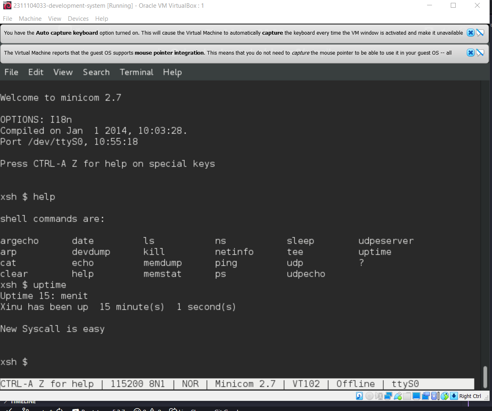

Jawaban Nomor 4 : 
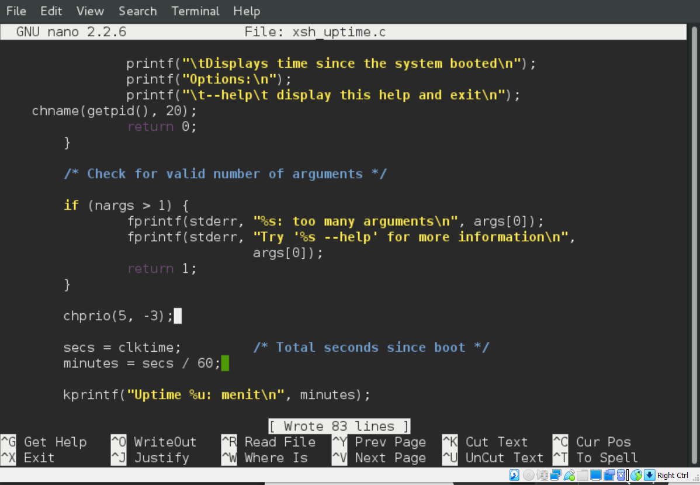

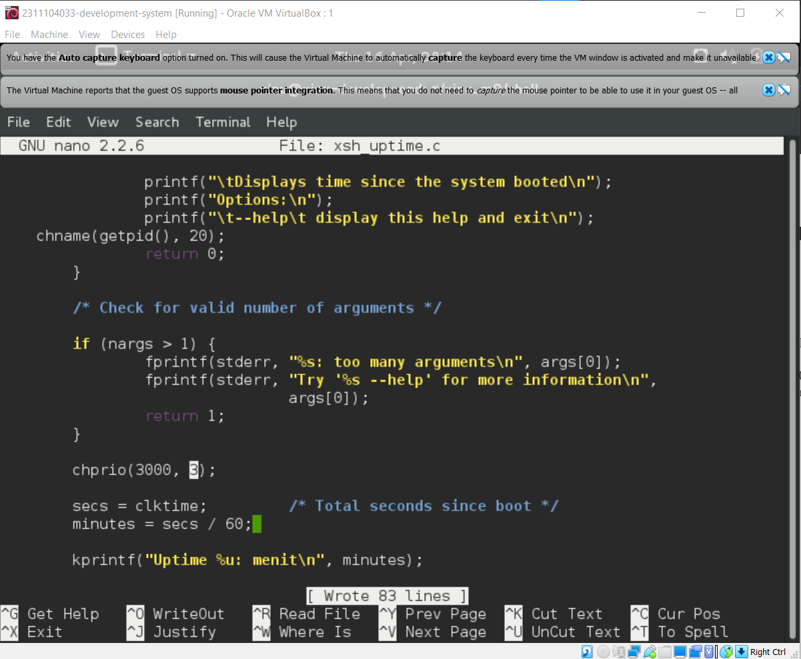

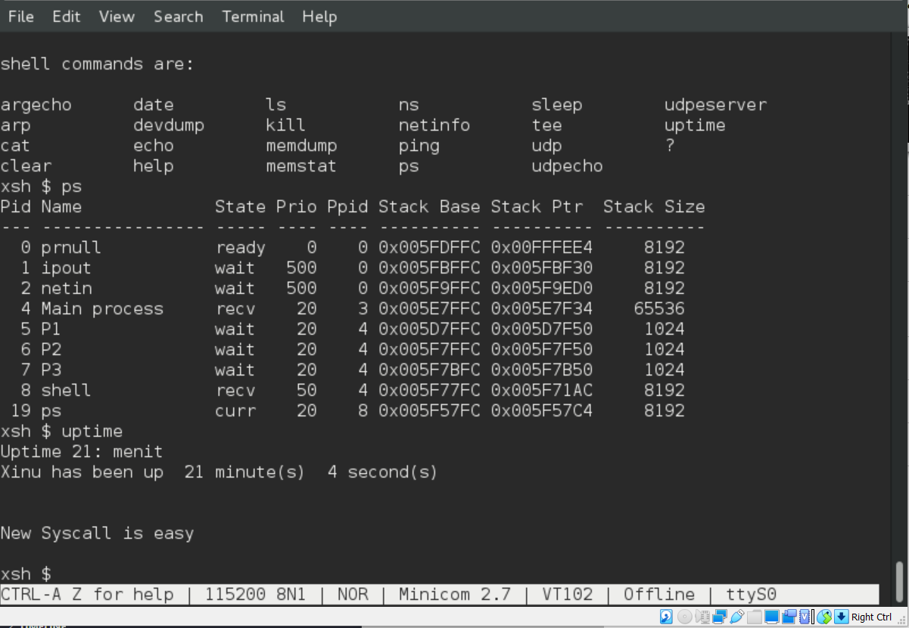