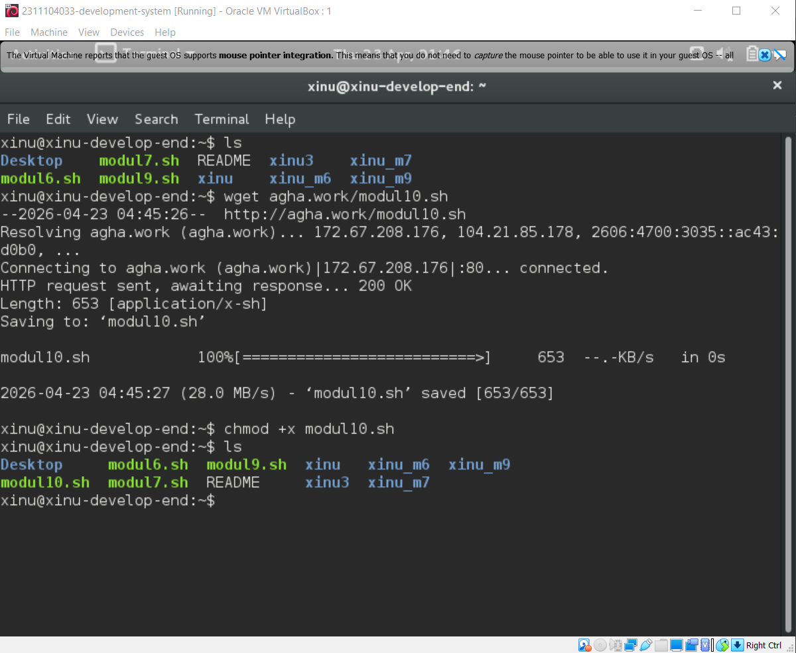
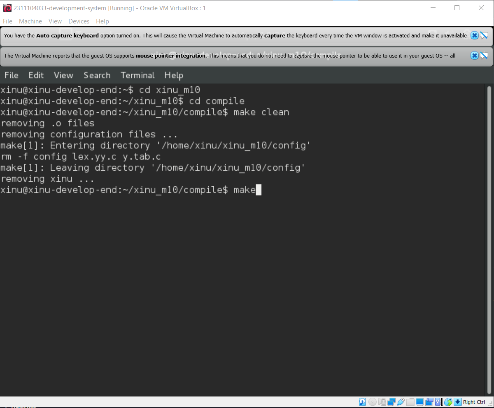
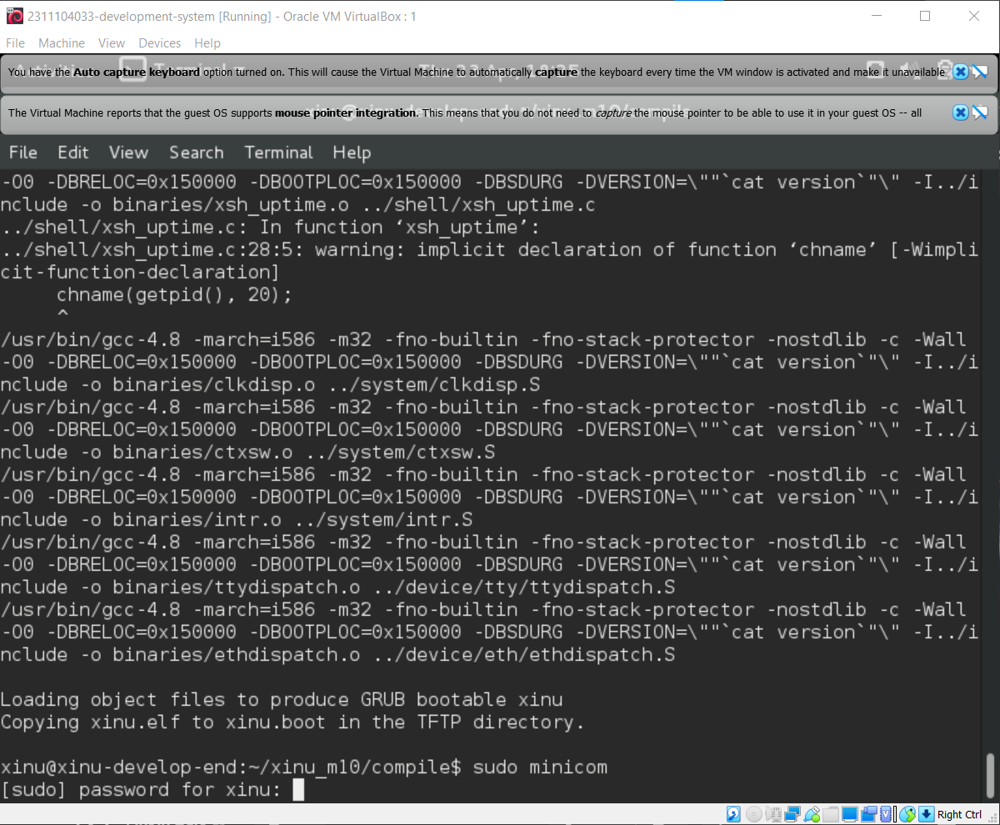
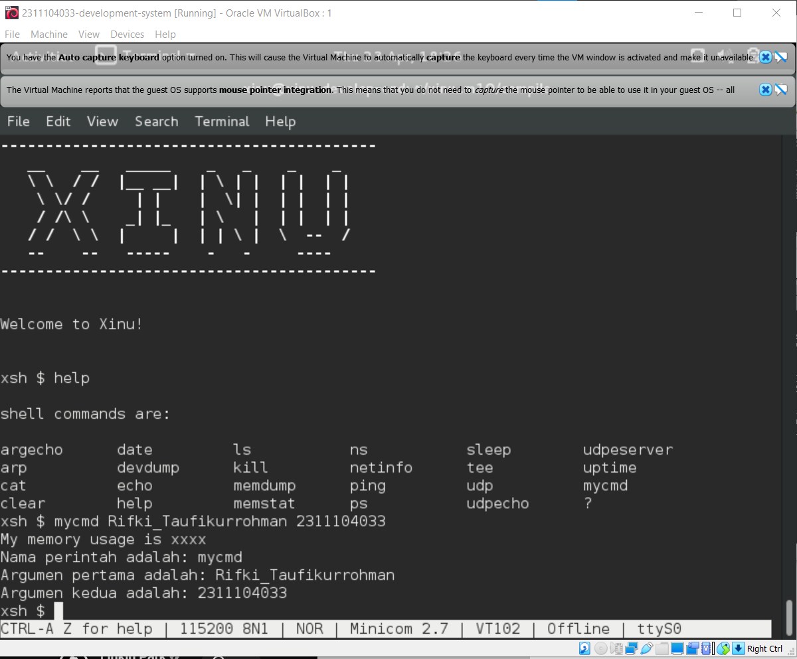
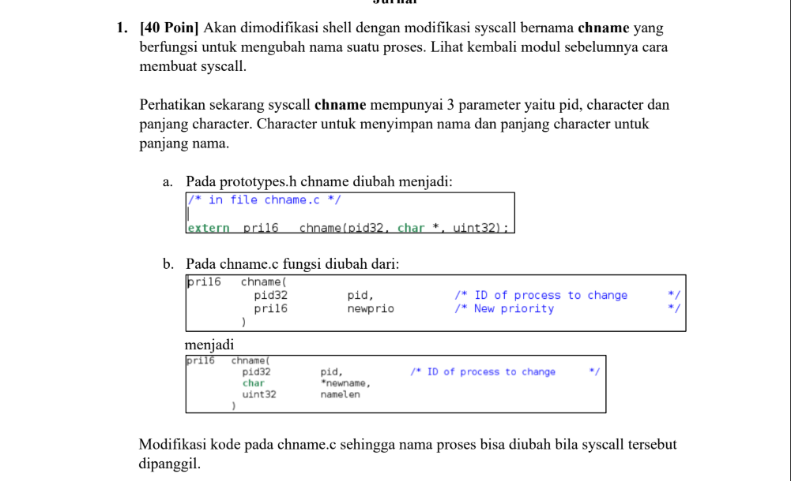
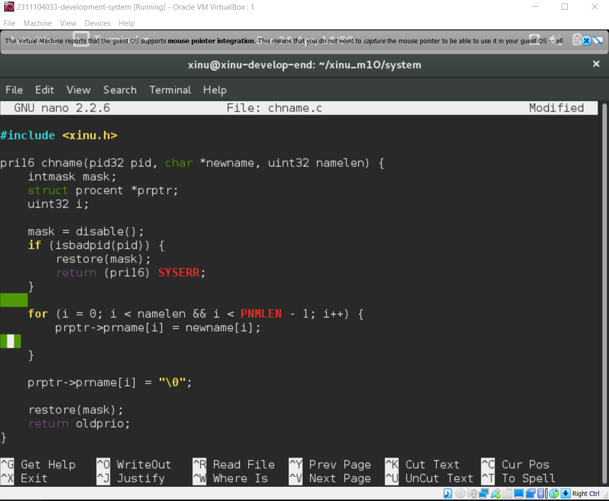
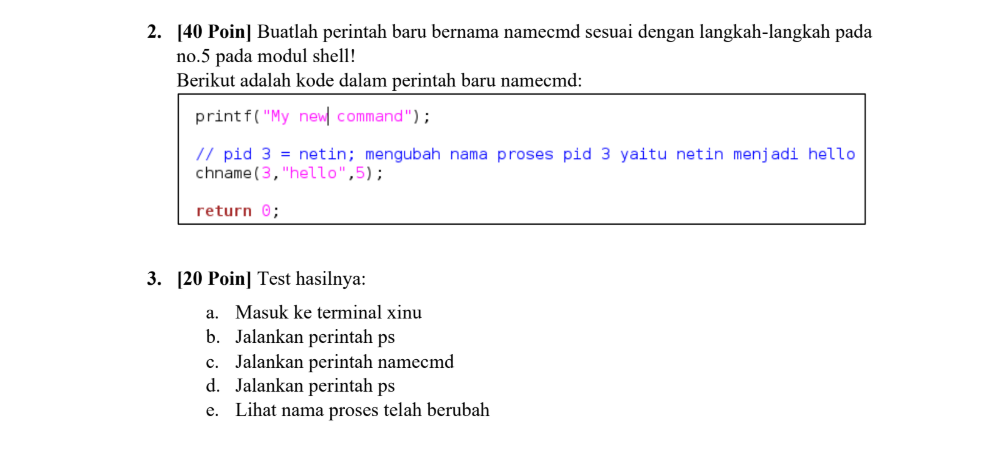
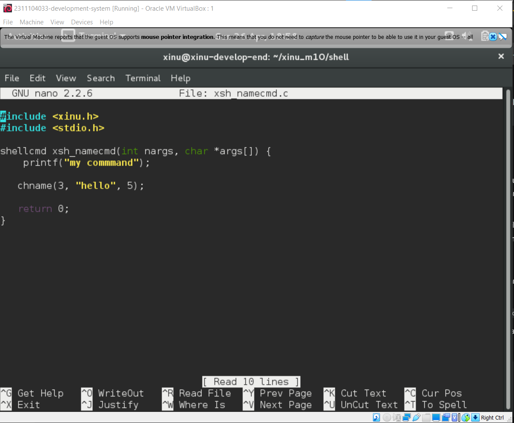
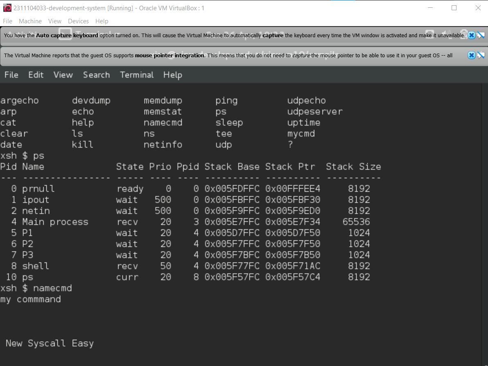

# <h1 align="center">Laporan Praktikum Modul X   Shell</h1>

Rifki Taufikurrohman - 2311104033

## Dasar Teori

Definisi dan Peran Shell sebagai Antarmuka
Shell merupakan sebuah program khusus yang berfungsi sebagai antarmuka (interface) antara pengguna dan kernel sistem operasi. Dalam arsitektur sistem operasi, pengguna umum jarang berinteraksi langsung dengan system call karena kompleksitasnya; sebaliknya, pengguna memberikan instruksi melalui terminal yang kemudian diproses oleh shell. Di dalam Xinu, shell bekerja dengan cara melakukan iterasi secara terus-menerus (infinite loop) untuk membaca input dari pengguna. Ketika pengguna menekan tombol enter, shell akan melakukan pemindaian terhadap baris input tersebut untuk mengekstrak nama perintah beserta argumen-argumen yang menyertainya sebelum akhirnya dieksekusi.

Mekanisme Command Parsing dan Eksekusi
Proses inti dari sebuah shell adalah pengenalan perintah atau command parsing. Setiap input yang masuk akan dipecah menjadi beberapa token, di mana token pertama dianggap sebagai nama perintah dan token berikutnya sebagai parameter pendukung. Berbeda dengan sistem operasi modern seperti Linux yang menyimpan perintah sebagai file terpisah di dalam direktori /bin, pada sistem operasi Xinu, seluruh perintah shell menyatu di dalam citra sistem (system image). Hal ini berarti setiap perintah yang tersedia sudah terdaftar di dalam struktur data internal saat sistem dikompilasi, sehingga shell dapat dengan cepat mencocokkan input pengguna dengan fungsi yang sesuai di dalam memori.

Struktur Perintah dan Perluasan Fitur pada Xinu
Untuk menambahkan fungsionalitas baru pada shell Xinu, diperlukan integrasi pada tiga komponen utama: tabel perintah (cmdtab), prototipe fungsi, dan implementasi kode sumber perintah itu sendiri. Tabel cmdtab di dalam shell.c bertugas memetakan string perintah yang diketik pengguna ke fungsi C yang relevan. Pengembang harus mendefinisikan prototipe fungsi dalam shprototype.h dan menulis logika programnya dalam file terpisah dengan awalan xsh_. Karena perintah-perintah ini bersifat statis di dalam kernel image, setiap perubahan atau penambahan perintah baru mengharuskan proses kompilasi ulang seluruh sistem Xinu agar instruksi tersebut dapat dikenali dan dijalankan oleh shell.

## Guided

## Jurnal
Soal

Nomor 1. 

Jawab : 

Nomor 2 dan 3

Jawab : 

