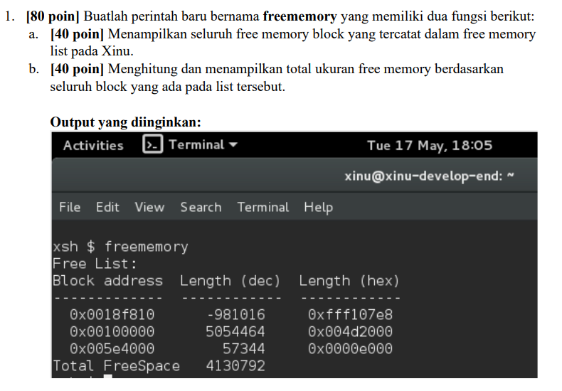
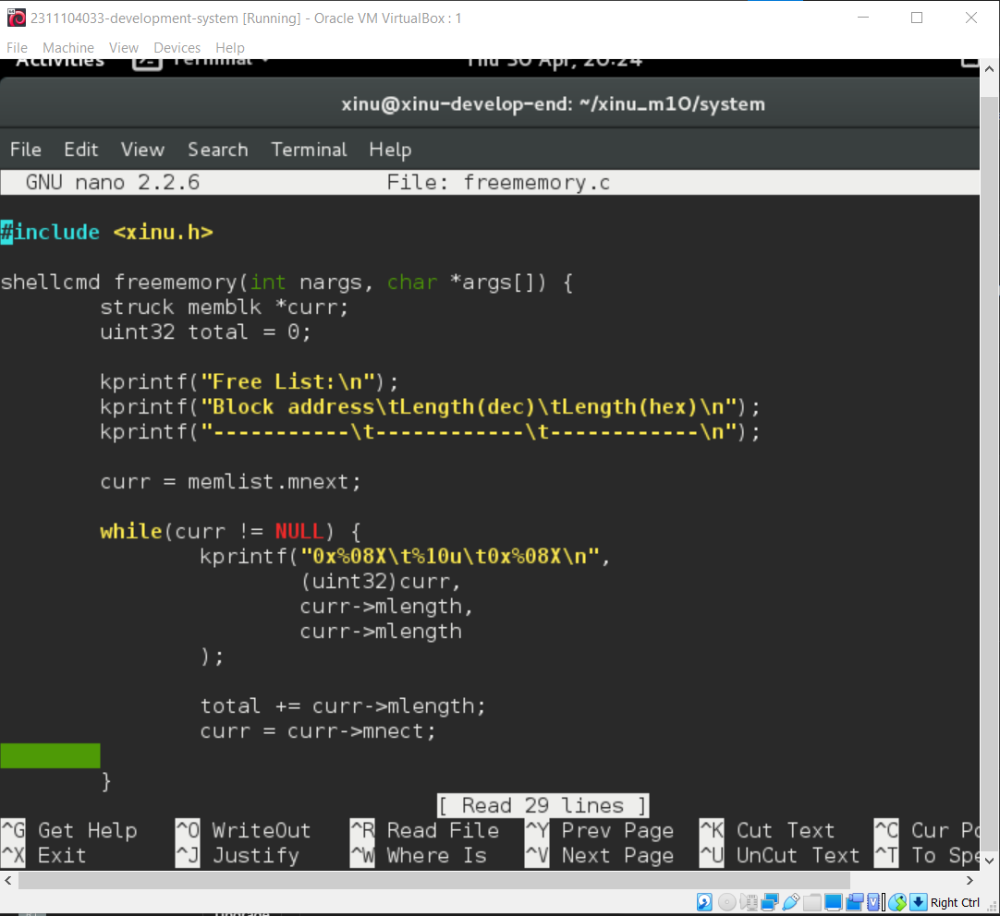
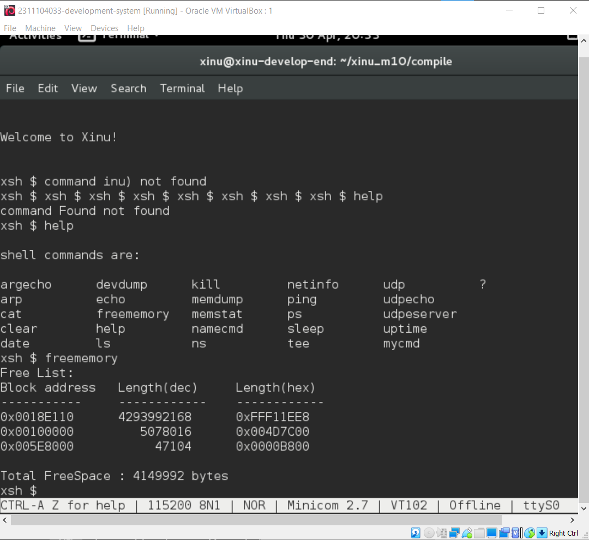
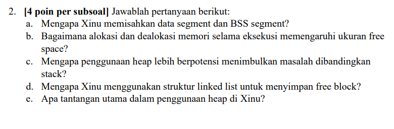

# <h1 align="center">Laporan Praktikum Modul XI <br> Memori Xinu</h1>
<p align="center">Rifki Taufikurrohman - 2311104033</p>

## Dasar Teori

Memori pada program C/C++ merupakan bagian penting yang digunakan untuk menyimpan instruksi dan data selama program dijalankan. Sistem operasi membagi memori program ke dalam beberapa segmen agar pengelolaan data menjadi lebih teratur dan efisien. Segmen tersebut terdiri dari code segment, data segment, stack segment, dan heap segment. Code segment digunakan untuk menyimpan instruksi program, data segment menyimpan variabel global dan static, stack digunakan untuk variabel lokal dan pemanggilan fungsi, sedangkan heap digunakan untuk alokasi memori secara dinamis saat program berjalan.

Pada bahasa C/C++, setiap segmen memori memiliki fungsi dan karakteristik yang berbeda. Stack memiliki proses alokasi yang cepat namun kapasitasnya terbatas, sedangkan heap memiliki kapasitas lebih fleksibel tetapi pengelolaannya harus dilakukan secara manual menggunakan new/delete atau malloc/free. Pemahaman mengenai segmen memori sangat penting bagi programmer karena berpengaruh terhadap efisiensi program, penggunaan sumber daya, serta pencegahan kesalahan seperti stack overflow dan memory leak. Dengan memahami cara kerja segmen memori, programmer dapat membuat program yang lebih optimal dan stabil.

## Guided

# 1. Jenis-Jenis Segmen Memori

## A. Code Segment (Text Segment)

Segmen ini menyimpan instruksi atau kode program yang akan dieksekusi oleh CPU.

### Karakteristik
- Bersifat *read-only*
- Berisi fungsi dan instruksi program
- Ukurannya tetap selama program berjalan

### Contoh
```cpp
void tampil() {
    cout << "Hello";
}
```

---

## B. Data Segment

Segmen ini menyimpan variabel global dan variabel static.

Data segment dibagi menjadi dua bagian:

### 1. Initialized Data Segment
Berisi variabel yang memiliki nilai awal.

#### Contoh
```cpp
int angka = 10;
```

### 2. Uninitialized Data Segment (BSS)
Berisi variabel yang belum diinisialisasi.

#### Contoh
```cpp
int nilai;
```

---

## C. Stack Segment

Stack digunakan untuk:
- Variabel lokal
- Parameter fungsi
- Pemanggilan fungsi

### Karakteristik
- Bersifat otomatis
- Menggunakan metode LIFO (*Last In First Out*)
- Ukurannya terbatas

### Contoh
```cpp
void fungsi() {
    int x = 5;
}
```

---

## D. Heap Segment

Heap digunakan untuk alokasi memori dinamis.

### Karakteristik
- Dialokasikan saat runtime
- Harus dikelola manual menggunakan `new/delete` atau `malloc/free`
- Ukurannya lebih fleksibel dibanding stack

### Contoh
```cpp
int *ptr = new int(10);
delete ptr;
```

# Jurnal Praktikum

## Soal 1



### Jawaban

#### a. Hasil Output





#### b. Analisis

Perintah `freememory` berhasil menampilkan seluruh free memory block yang terdapat pada free memory list di Xinu. Setiap block menampilkan alamat memori, ukuran dalam bentuk desimal, dan ukuran dalam bentuk hexadecimal. Program juga menghitung total keseluruhan free memory yang masih tersedia pada sistem.

---

# Soal 2



## Jawaban

### a. Mengapa Xinu memisahkan data segment dan BSS segment?

Karena data segment menyimpan variabel global atau static yang sudah diinisialisasi, sedangkan BSS segment menyimpan variabel yang belum diinisialisasi. Pemisahan ini membuat penggunaan memori lebih efisien karena BSS tidak perlu disimpan penuh di file executable.

---

### b. Bagaimana alokasi dan dealokasi memori selama eksekusi mempengaruhi ukuran free space?

Saat memori dialokasikan, ukuran free space akan berkurang karena sebagian memori digunakan oleh proses. Ketika memori dibebaskan kembali, ukuran free space akan bertambah karena block memori dikembalikan ke free memory list.

---

### c. Mengapa penggunaan heap lebih berpotensi menimbulkan masalah dibandingkan stack?

Heap dikelola secara manual oleh programmer sehingga lebih rentan menyebabkan memory leak, dangling pointer, dan fragmentasi memori jika dealokasi tidak dilakukan dengan benar. Sedangkan stack dikelola otomatis oleh sistem sehingga lebih aman.

---

### d. Mengapa Xinu menggunakan struktur linked list untuk menyimpan free block?

Karena linked list memudahkan proses penambahan, penghapusan, dan penggabungan block memori kosong secara dinamis tanpa memerlukan ukuran array tetap.

---

### e. Apa tantangan utama dalam penggunaan heap di Xinu?

Tantangan utamanya adalah fragmentasi memori dan pengelolaan alokasi/dealokasi agar tidak terjadi memory leak atau kegagalan alokasi ketika memori terpecah menjadi block kecil.