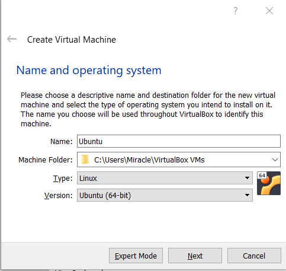
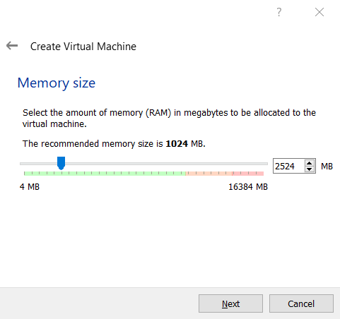
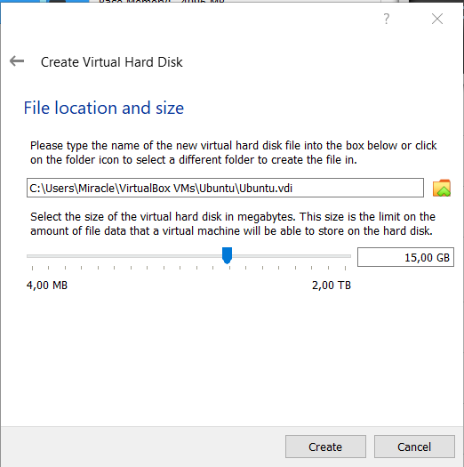
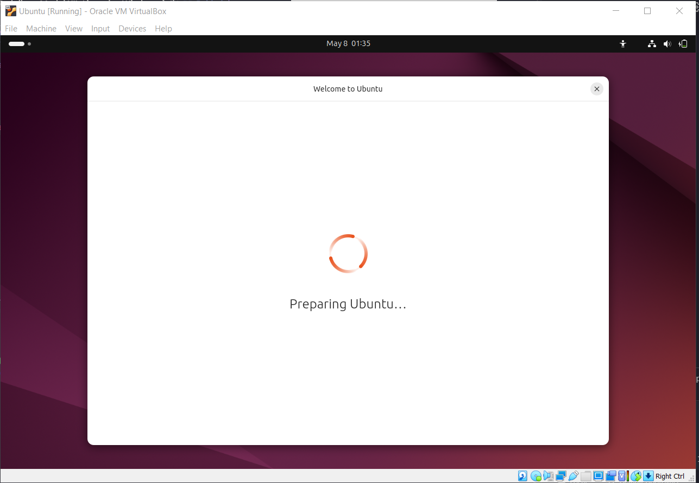
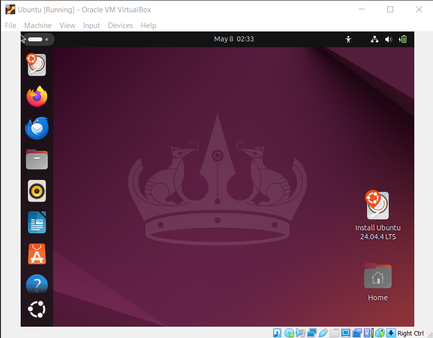
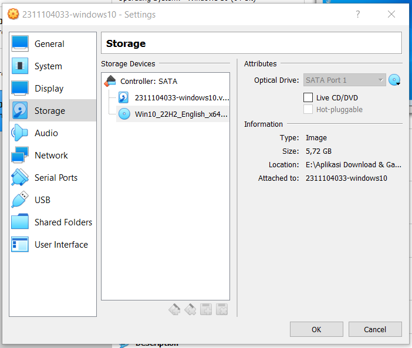
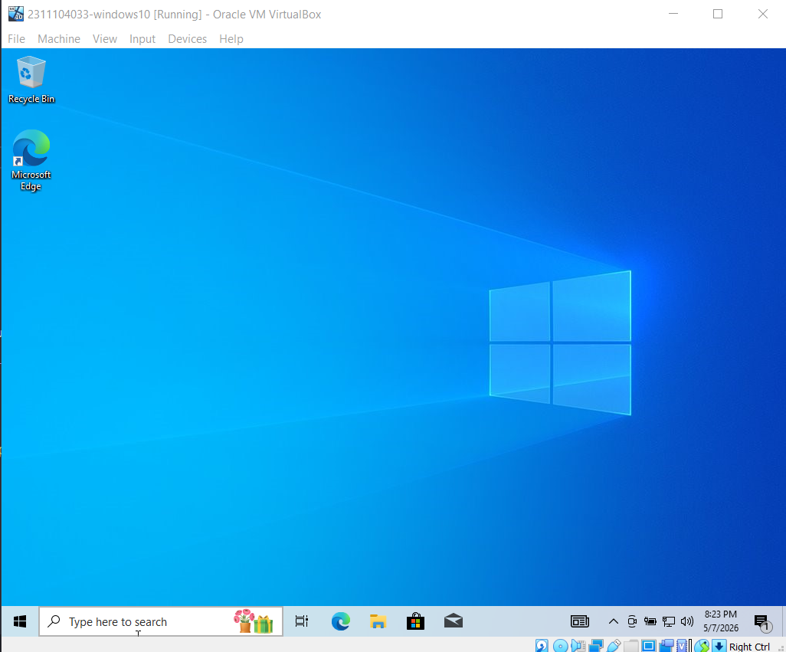
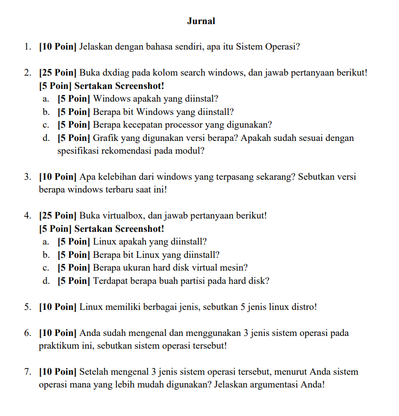
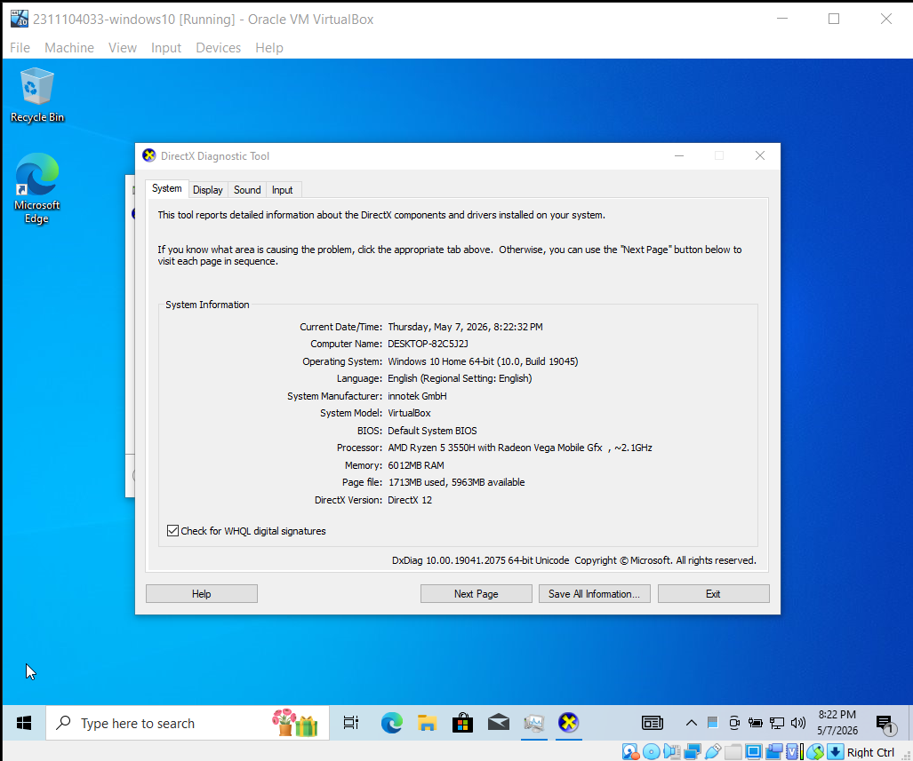

# <h1 align="center">Laporan Praktikum Modul XII   Linux dan Windows</h1>

<strong>Rifki Taufikurrohman - 2311104033</strong>

---

## Dasar Teori

### 1. Sistem Operasi
Sistem operasi merupakan perangkat lunak utama yang berfungsi sebagai penghubung antara pengguna dengan perangkat keras komputer. Sistem operasi bertugas mengatur sumber daya komputer seperti prosesor, memori, penyimpanan, dan perangkat input/output agar dapat digunakan secara efisien. Selain itu, sistem operasi juga menyediakan antarmuka bagi pengguna untuk menjalankan aplikasi dan mengelola file.

Contoh sistem operasi yang banyak digunakan adalah **Linux** dan **Microsoft Windows**.

### 2. Pengertian Linux
Linux merupakan sistem operasi berbasis *open-source* yang dikembangkan pertama kali oleh Linus Torvalds pada tahun 1991. Linux banyak digunakan pada server, komputer pribadi, dan perangkat *embedded* karena memiliki tingkat keamanan, stabilitas, dan fleksibilitas yang tinggi.

Linux menggunakan antarmuka berbasis *Command Line Interface* (CLI) maupun *Graphical User Interface* (GUI). Dalam praktikum, penggunaan terminal atau shell sangat penting karena sebagian besar administrasi sistem dilakukan melalui perintah teks.

### 3. Pengertian Windows
Microsoft Windows adalah sistem operasi yang dikembangkan oleh Microsoft dengan antarmuka utama berbasis GUI (*Graphical User Interface*). Windows dirancang agar mudah digunakan oleh pengguna umum maupun profesional. Windows menyediakan berbagai fitur seperti manajemen file, jaringan, keamanan, dan dukungan aplikasi yang luas.

---

## Guided: Instalasi Sistem Operasi

### Install Ubuntu di VirtualBox

  
  
<em>Langkah 1: Konfigurasi awal VM Ubuntu</em>

   
  
  
<em>Langkah 2: Alokasi Memori dan Prosesor</em>

   
  
  
<em>Langkah 3: Pengaturan Virtual Hard Disk</em>

   
  
  
<em>Langkah 4: Pemilihan ISO Image</em>

   
  
  
<em>Langkah 5: Proses Instalasi Berjalan</em>

---

### Install Windows 10 di VirtualBox

  
  
<em>Langkah 1: Konfigurasi Storage Controller</em>

   
  
  
<em>Langkah 2: Memasukkan File ISO Windows 10</em>

---

## Jurnal

### Pertanyaan Tugas

  

---

### Jawaban Jurnal

**1. Pengertian Sistem Operasi**
Sistem operasi adalah komponen perangkat lunak dari sebuah sistem komputer yang bertanggung jawab untuk mengatur dan mengoordinasikan aktivitas-aktivitas serta pembagian *resource* komputer.

**2. Informasi Sistem Menggunakan `dxdiag`**

  

* **a. Sistem operasi:** Windows 10
* **b. Arsitektur:** 64 bit
* **c. Processor:** ~2.1 GHz (AMD Ryzen 5 3550H)
* **d. Versi DirectX:** DirectX 12

**3. Kelebihan Windows 10**
* Memiliki fitur keamanan Windows Hello.
* Dukungan aplikasi sangat luas (kompatibilitas tinggi).
* Fitur multitasking seperti *Snap Assist* sangat membantu produktivitas.
* Integrasi ekosistem dengan layanan cloud Microsoft.

**4. Informasi Instalasi Linux**
* **a. Distribusi Linux:** Ubuntu
* **b. Arsitektur:** 64 Bit
* **c. Kapasitas penyimpanan:** 15 GB
* **d. Jumlah partisi:** 2 Partisi

**5. Contoh Distribusi Linux**
Ubuntu, Debian, Fedora, Kali Linux, dan Arch Linux.

**6. Contoh Sistem Operasi**
Windows, Linux, dan Xinu.

**7. Sistem Operasi yang Paling Mudah Digunakan**
Menurut saya, **Windows** adalah sistem operasi yang paling mudah digunakan. Alasannya karena antarmuka grafisnya (GUI) sangat *user-friendly*, sebagian besar aplikasi produktivitas mendukung Windows secara *native*, dan hampir semua konfigurasi sistem dapat dilakukan melalui menu visual tanpa harus bergantung pada perintah teks (CLI).