# Laporan Praktikum Modul XIII  
## Perintah Dasar Linux

<p align="center">
Rifki Taufikurrohman - 2311104033
</p>

---

# Dasar Teori

## 1. Sistem Operasi Linux dan Command Line Interface (CLI)

Linux adalah sistem operasi *open-source* berbasis Unix yang mengeksekusi sebagian besar perintah dasarnya melalui shell default bernama **Bash** (`/bin/bash`). Pengguna berinteraksi dengan sistem menggunakan konsol/terminal.

Penulisan perintah di Linux bersifat **case sensitive** (membedakan huruf besar dan kecil). Struktur standar penulisan perintahnya adalah sebagai berikut:

$$
\text{\$ Perintah [-opsi] [argument\_1] [argument\_2]}
$$

Terdapat dua mode representasi user pada terminal Linux yang dibedakan berdasarkan hak aksesnya:

- **Mode Root (`#`)**  
  Merupakan user mode dengan hak akses tertinggi dan tidak terbatas terhadap seluruh sistem. File perintahnya disimpan di direktori `/etc/sbin`.

- **Mode User Biasa (`$`)**  
  Merupakan tanda untuk user biasa yang memiliki hak akses terbatas. File perintahnya disimpan di direktori `/etc/bin`.

---

## 2. Perintah-Perintah Dasar Manajemen File dan Direktori

Untuk mengelola berkas dan navigasi di dalam sistem, Linux menyediakan beberapa perintah standar.

### `ls` (List)

Digunakan untuk melihat isi dari sebuah direktori aktif.

- `-l` → Menampilkan detail file (hak akses, pemilik, ukuran, tanggal)
- `-a` → Menampilkan seluruh file termasuk yang tersembunyi (*hidden file*)
- `-s` → Menampilkan ukuran file dalam bentuk blok
- `-h` → Mengubah format ukuran file agar mudah dibaca manusia (KB, MB, GB)

### `cd` (Change Directory)

Digunakan untuk berpindah dari direktori kerja aktif ke direktori tujuan.

Contoh:

```bash
cd ..
```

Digunakan untuk kembali ke direktori induk.

### `pwd` (Print Working Directory)

Digunakan untuk menampilkan jalur (*path*) atau alamat lengkap dari direktori yang sedang aktif saat ini.

### `mkdir` (Make Directory)

Perintah untuk membuat direktori baru.

Opsi `-p` digunakan untuk membuat direktori bertingkat sekaligus dalam satu perintah.

### `cp` (Copy)

Digunakan untuk menggandakan file atau folder.

Opsi `-R` wajib digunakan untuk menyalin direktori beserta seluruh isinya secara rekursif.

### `mv` (Move)

Digunakan untuk memindahkan file/direktori atau mengubah nama (*rename*) jika lokasi sumber dan tujuannya sama.

### `rm` (Remove)

Digunakan untuk menghapus file atau direktori.

- `-f` → Memaksa penghapusan
- `-rf` → Menghapus direktori beserta isinya secara paksa

### `man` (Manual)

Digunakan untuk memunculkan halaman panduan resmi mengenai fungsi dan opsi dari suatu perintah Linux.

---

## 3. Fitur Pipeline dan Redirection

Terminal Linux menyediakan fitur interaksi antar-proses yang sangat efisien.

### Pipeline (`|`)

Berfungsi menghubungkan dua perintah atau lebih secara berurutan. Output dari perintah pertama akan langsung dijadikan input untuk perintah berikutnya.

### Redirection

Fasilitas untuk mengalihkan input atau output standar dari atau ke dalam sebuah file teks.

- `>` → Menyimpan output ke file baru (*overwrite*)
- `>>` → Menyimpan output dengan menambahkannya di bagian akhir (*append*)
- `<` dan `<<` → Menggunakan isi file sebagai input proses

---

## 4. GNU Compiler Collection (GCC)

**GCC** (*GNU Compiler Collection*) adalah komponen penting dari *GNU Toolchain* yang digunakan untuk menyusun atau mengompilasi kode program.

GCC mendukung berbagai bahasa pemrograman seperti:

- C
- C++
- Java
- Fortran
- Go

GCC bersifat portabel dan mendukung *cross-compiler*, yaitu dapat menghasilkan file executable untuk platform yang berbeda.

### Proses Kompilasi Program C

```bash
gcc source_code.c -o program_hasil
```

---

# Jurnal

## Soal 1

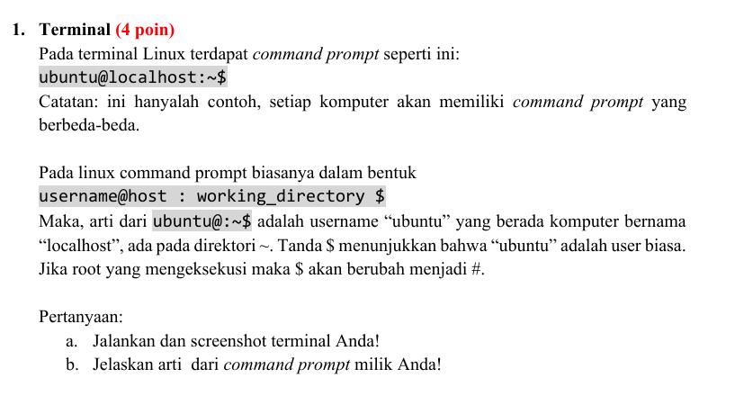

### Jawab

#### a.

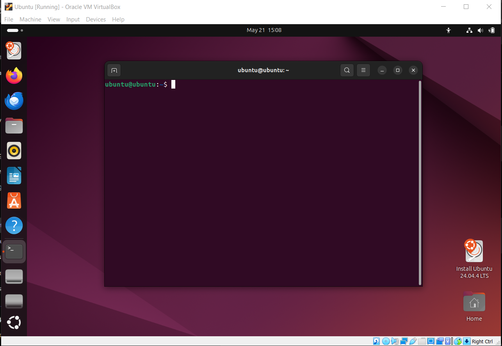

#### b. Penjelasan

- `ubuntu` pertama → username
- `ubuntu` kedua → hostname / nama komputer
- `~` → sedang berada di home directory
- `$` → user biasa (bukan root)

---

## Soal 2

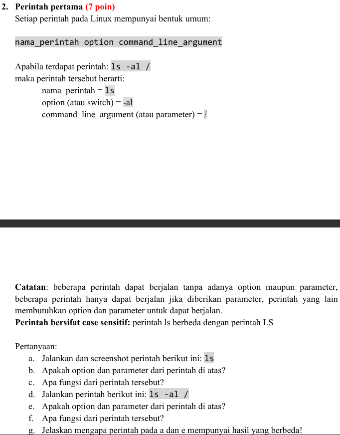

### Jawab

#### a.

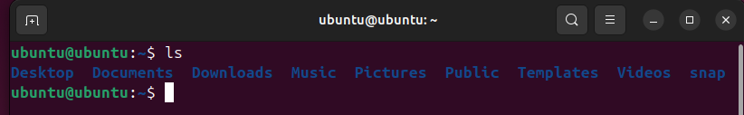

#### b.

Tidak ada option dan parameter.

#### c.

Menampilkan isi folder saat ini.

#### d.

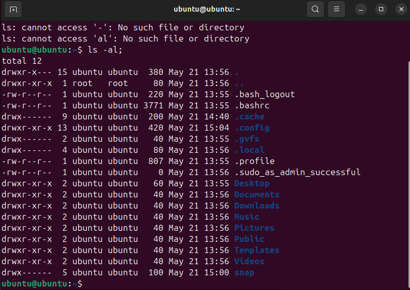

#### e.

Option = `-al` dan parameter = `/`

#### f.

Menampilkan seluruh isi direktori root secara detail.

#### g.

Perbedaannya karena:

- `ls` → menampilkan isi folder saat ini saja
- `ls -al /` → menampilkan isi direktori root secara detail termasuk file tersembunyi

---

## Soal 3

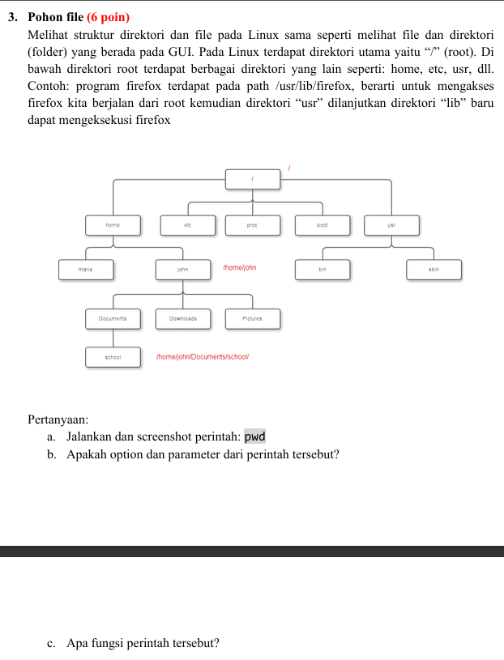

### Jawab

#### a.

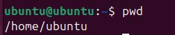

#### b.

Tidak ada option maupun parameter.

#### c.

Menampilkan lokasi direktori saat ini.

---

## Soal 4

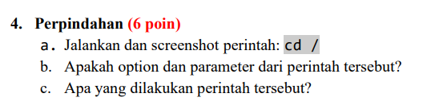

### Jawab

#### a.


#### b.

Option tidak ada dan parameter = `/`

#### c.

Berpindah ke root directory.

---

## Soal 5

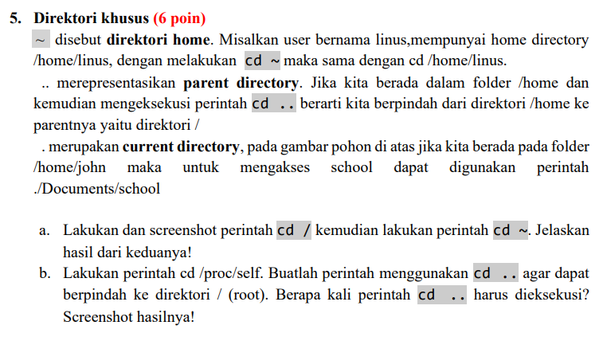

### Jawab

#### a.

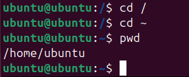

**Penjelasan:**

- `cd /` → pindah ke root
- `cd ~` → kembali ke home user

#### b.

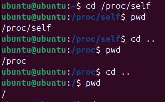

Melakukan 3 kali eksekusi.

---

## Soal 6

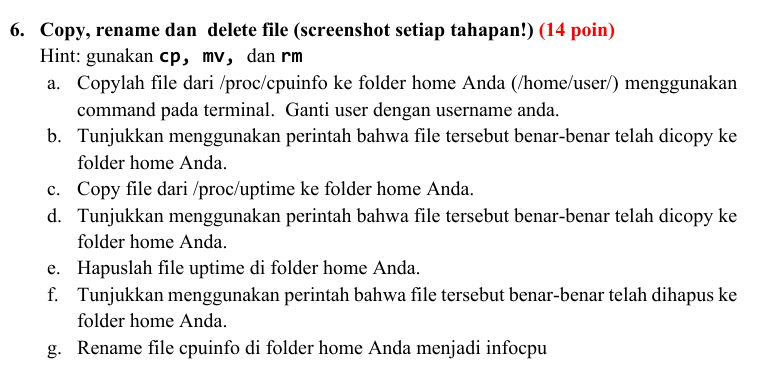

### Jawab

#### a. Copy file `/proc/cpuinfo` ke folder home


#### b. Menunjukkan file berhasil dicopy

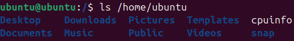

#### c. Copy file `/proc/uptime` ke folder home


#### d. Menunjukkan file berhasil dicopy

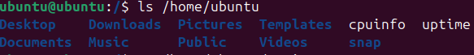

#### e. Menghapus file `uptime`


#### f. Menunjukkan file berhasil dihapus

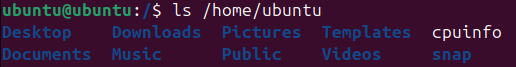

#### g. Rename file `cpuinfo` menjadi `infocpu`

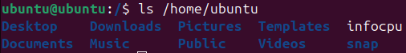

---

## Soal 7

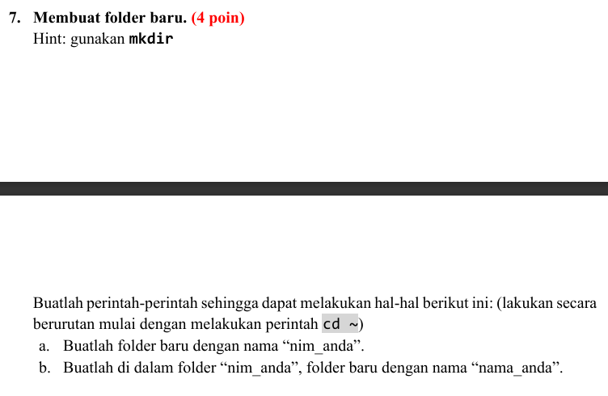

### Jawab

#### a. Membuat folder NIM


#### b. Membuat folder nama di dalam folder NIM

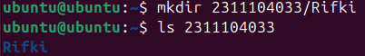

---

## Soal 8

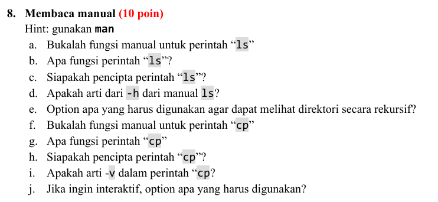

### Jawab

#### a. Membuka manual `ls`

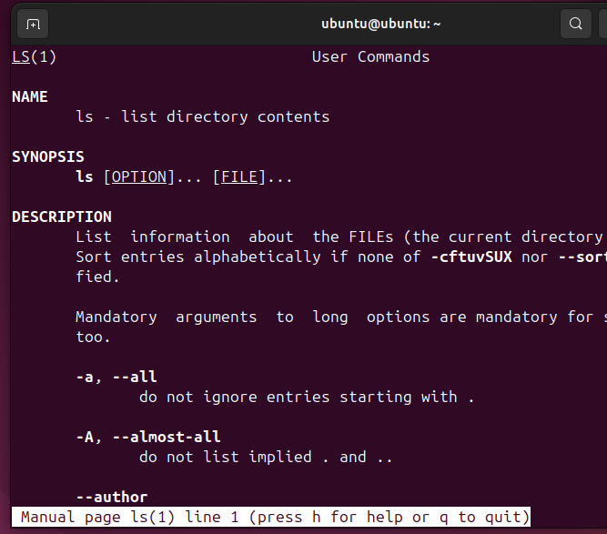

#### b. Fungsi perintah `ls`

Menampilkan isi direktori.

#### c. Pencipta perintah `ls`

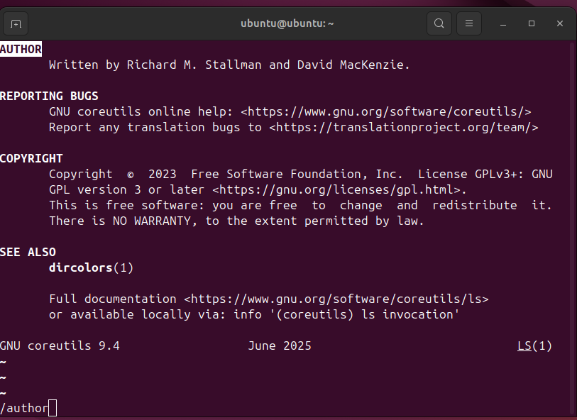

#### d. Arti option `-h`

Human readable size.

#### e. Option untuk melihat direktori secara rekursif

`-R`

#### f. Membuka manual `cp`

```bash
man cp
```

#### g. Fungsi perintah `cp`

Menyalin file atau folder.

#### h. Pencipta perintah `cp`

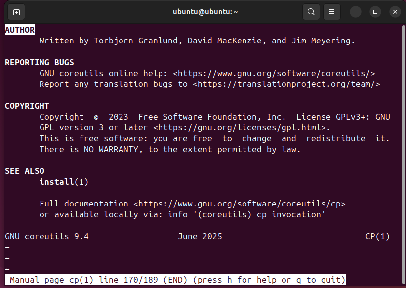

#### i. Arti option `-v`

Verbose → menampilkan proses copy.

#### j. Option agar interaktif

`-i`

---

## Soal 9

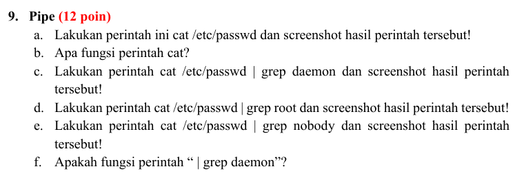

### Jawab

#### a. Perintah `cat /etc/passwd`

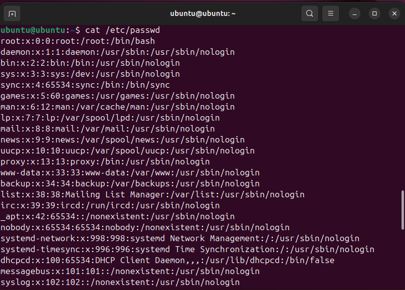

#### b. Fungsi perintah `cat`

Menampilkan isi file.

#### c. Perintah `grep daemon`

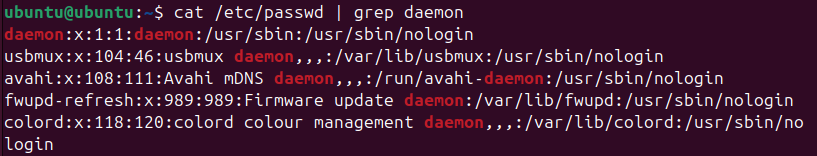

#### d. Perintah `grep root`

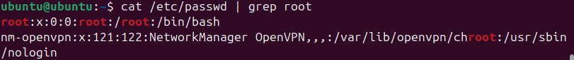

#### e. Perintah `grep nobody`

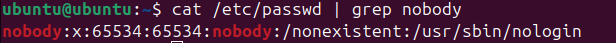

#### f. Fungsi `| grep daemon`

Menyaring output agar hanya menampilkan kata `daemon`.

---

## Soal 10

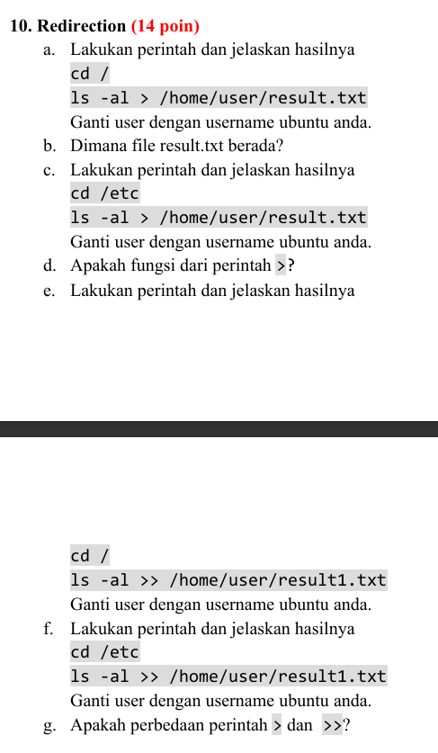

### Jawab

#### a. Redirection menggunakan `>`

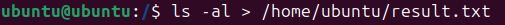

**Penjelasan:**  
Perintah tersebut menyimpan output `ls -al` ke dalam file `result.txt`.

#### b. Lokasi file `result.txt`

```bash
/home/ubuntu/result.txt
```

#### c. Redirection kedua menggunakan `>`

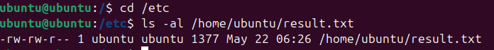

**Penjelasan:**  
Isi file sebelumnya ditimpa (*overwrite*) oleh output baru.

#### d. Fungsi `>`

Menyimpan output ke file dan menimpa isi sebelumnya.

#### e. Redirection menggunakan `>>`

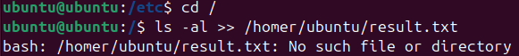

#### f. Redirection kedua menggunakan `>>`

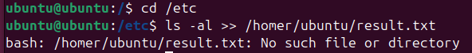

#### g. Perbedaan `>` dan `>>`

- `>` → overwrite / menimpa isi file
- `>>` → append / menambahkan isi di akhir file

---

## Soal 11

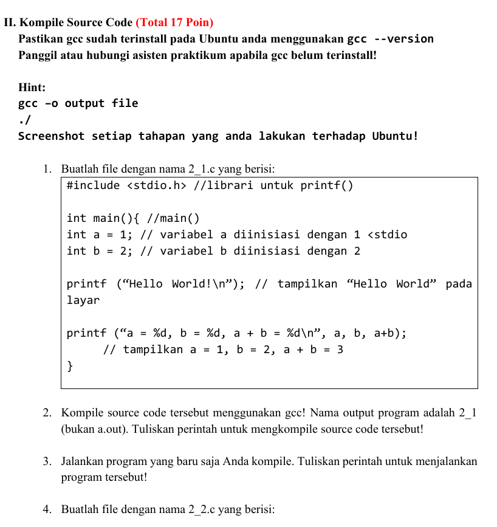

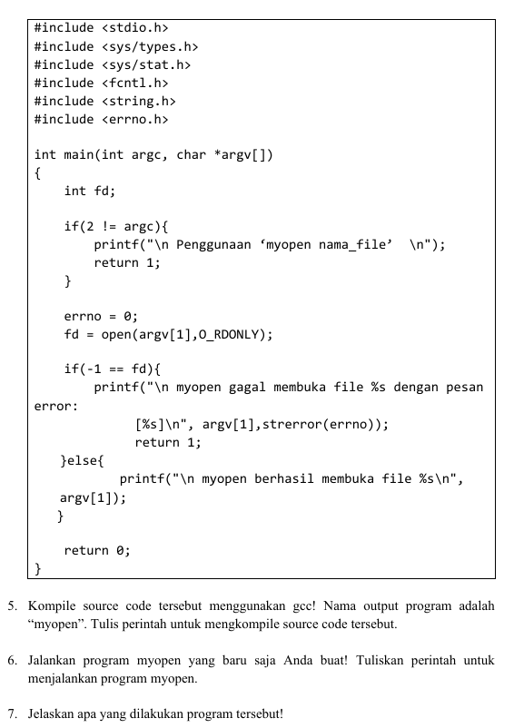

### Jawab

#### 1. Membuat file `2_1.c`

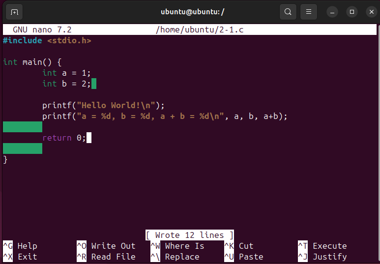

#### 2. Mengkompile program `2_1.c`

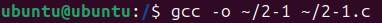

#### 3. Menjalankan program hasil kompilasi

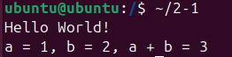

#### 4. Membuat file `2_2.c`

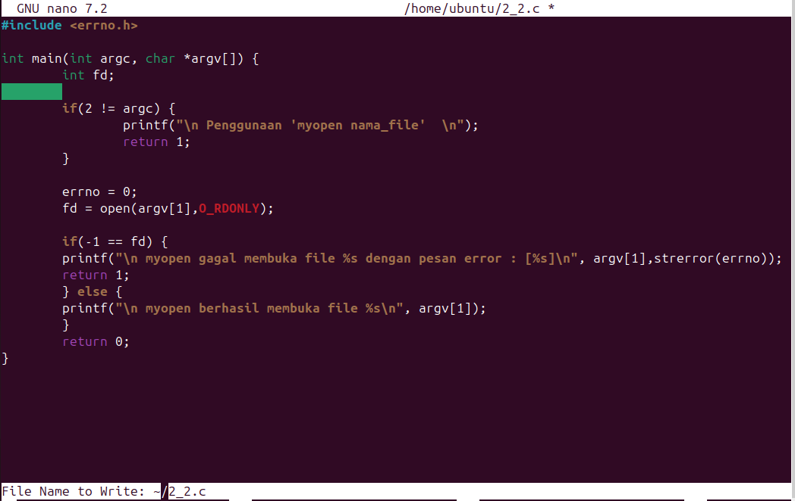

#### 5. Mengkompile program menjadi `myopen`


#### 6. Menjalankan program `myopen`

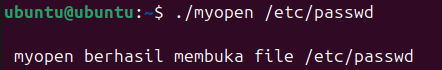

#### 7. Fungsi program

Program digunakan untuk membuka file menggunakan fungsi `open()`.

- Jika file berhasil dibuka maka program akan menampilkan pesan sukses.
- Jika file gagal dibuka maka program akan menampilkan pesan error sesuai penyebab kegagalan.