# <h1 align="center">Laporan Praktikum Modul XIV <br> Scripting</h1>

<p align="center">
Rifki Taufikurrohman - 2311104033
</p>

---

# Dasar Teori

## 1. Shell Script pada Linux

Shell script adalah kumpulan perintah Linux yang ditulis dalam sebuah file teks dan dijalankan secara otomatis oleh shell. Shell script digunakan untuk mengotomatisasi pekerjaan yang dilakukan berulang kali pada sistem operasi Linux, seperti pengolahan file, manajemen sistem, hingga administrasi server.

Pada sistem operasi Linux, shell yang paling umum digunakan adalah Bash (*Bourne Again Shell*). File script biasanya memiliki ekstensi `.sh` dan dapat dijalankan melalui terminal menggunakan interpreter Bash.

Contoh menjalankan script:

```bash
chmod +x namafile.sh
./namafile.sh
```

Perintah `chmod +x` digunakan untuk memberikan hak akses eksekusi pada file script.

---

## 2. Variabel pada Bash

Variabel digunakan untuk menyimpan data sementara yang dapat dipanggil kembali di dalam script. Pada Bash, variabel tidak memerlukan tipe data khusus.

Contoh:

```bash
nama="Rifki"
echo $nama
```

Perintah `echo` digunakan untuk menampilkan isi variabel ke terminal.

---

## 3. Perintah Dasar pada Bash Script

Beberapa perintah dasar yang digunakan dalam praktikum ini antara lain:

| Perintah | Fungsi |
|---|---|
| `echo` | Menampilkan teks ke terminal |
| `date` | Menampilkan tanggal dan waktu |
| `who` | Menampilkan user yang sedang login |
| `read` | Menerima input dari pengguna |
| `chmod` | Mengubah hak akses file |

---

## 4. Pengondisian pada Bash

Pengondisian digunakan untuk menentukan aksi berdasarkan kondisi tertentu. Bash menyediakan struktur `if`, `elif`, dan `else`.

Contoh:

```bash
if [ $jam -lt 12 ]
then
    echo "Selamat pagi"
else
    echo "Selamat malam"
fi
```

Pada praktikum ini, pengondisian digunakan untuk menentukan ucapan berdasarkan waktu tertentu.

---

## 5. Perulangan pada Bash

Perulangan digunakan untuk menjalankan perintah secara berulang. Bash mendukung beberapa jenis perulangan seperti `for` dan `while`.

### a. Perulangan While

Digunakan ketika perulangan berjalan selama kondisi bernilai benar.

Contoh:

```bash
while [ $angka -gt 0 ]
do
    echo $angka
    angka=$((angka-1))
done
```

### b. Perulangan For

Digunakan untuk melakukan iterasi terhadap kumpulan data atau file.

Contoh:

```bash
for file in *
do
    echo $file
done
```

---

## 6. Input Pengguna

Bash script dapat menerima input dari pengguna menggunakan perintah `read`.

Contoh:

```bash
echo "Masukkan angka:"
read angka
```

Input tersebut kemudian dapat diproses di dalam script.

---

## 7. Parameter Script

Parameter script adalah nilai yang diberikan saat menjalankan file script melalui terminal. Parameter dapat diakses menggunakan variabel khusus seperti `$1`, `$2`, dan `$#`.

Contoh:

```bash
./script.sh 5
echo $1
```

Variabel `$#` digunakan untuk mengetahui jumlah parameter yang diberikan oleh pengguna.

---

# Jurnal

# Soal 1

## Soal

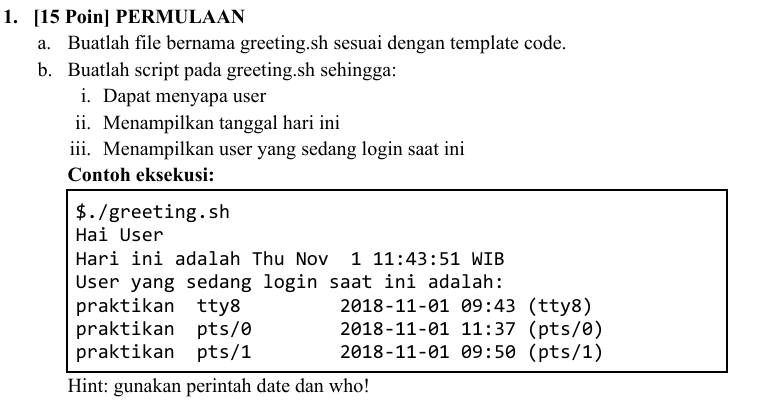

## Jawaban

### Source Code

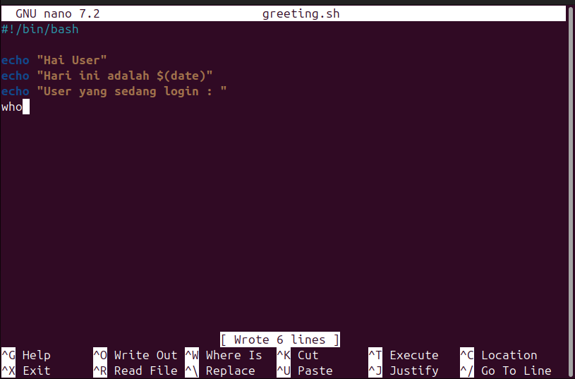

### Hasil Running

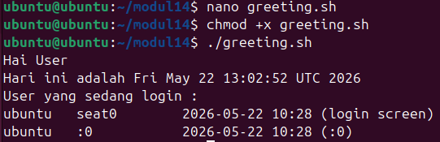

---

# Soal 2

## Soal

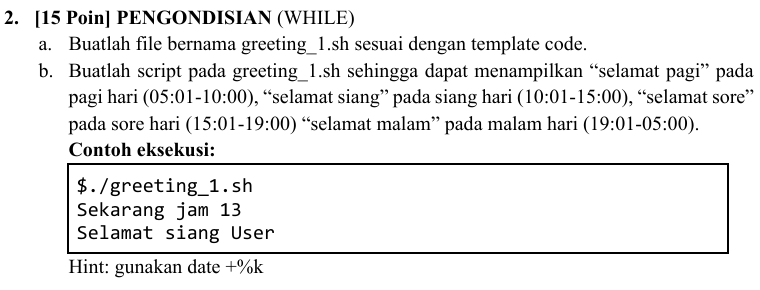

## Jawaban

### Source Code

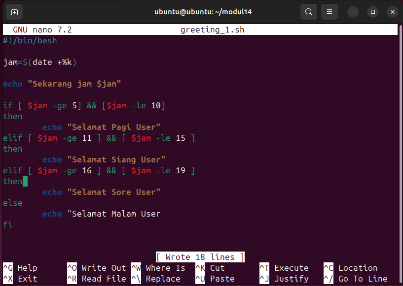

### Hasil Running

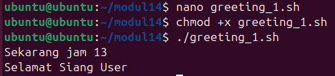

---

# Soal 3

## Soal

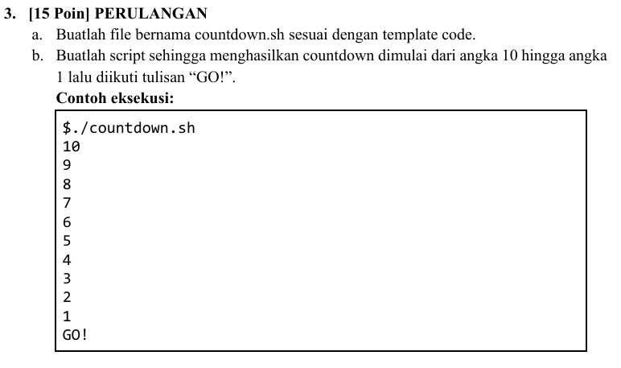

## Jawaban

### Source Code

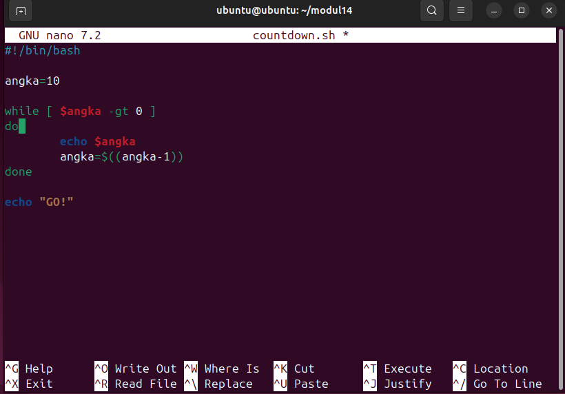

### Hasil Running

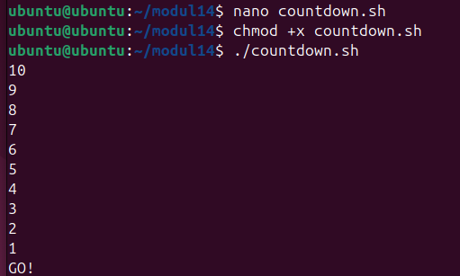

---

# Soal 4

## Soal

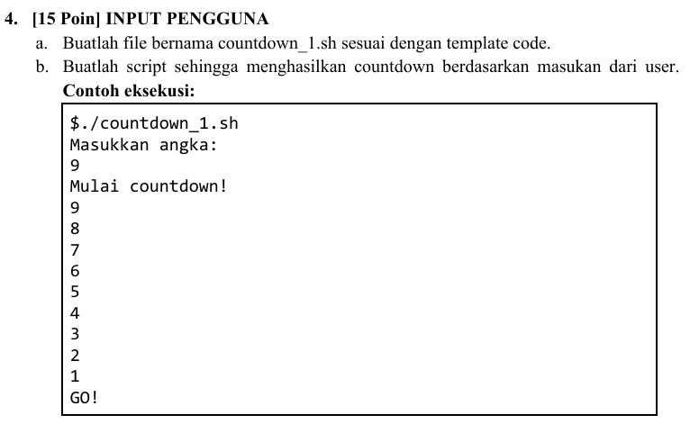

## Jawaban

### Source Code

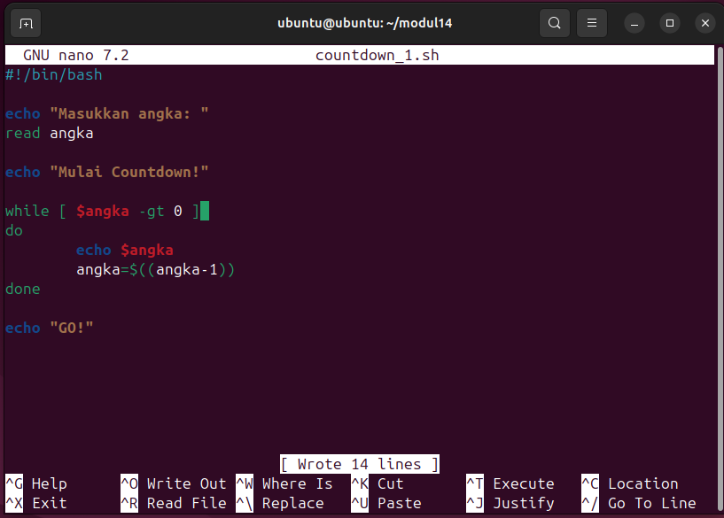

### Hasil Running

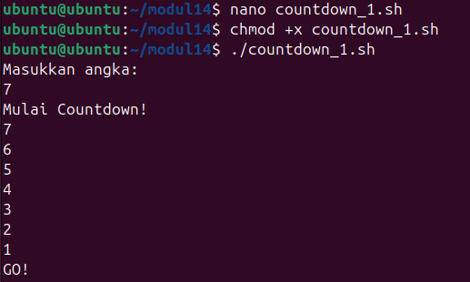

---

# Soal 5

## Soal

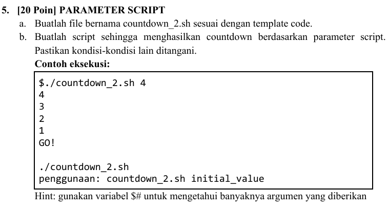

## Jawaban

### Source Code

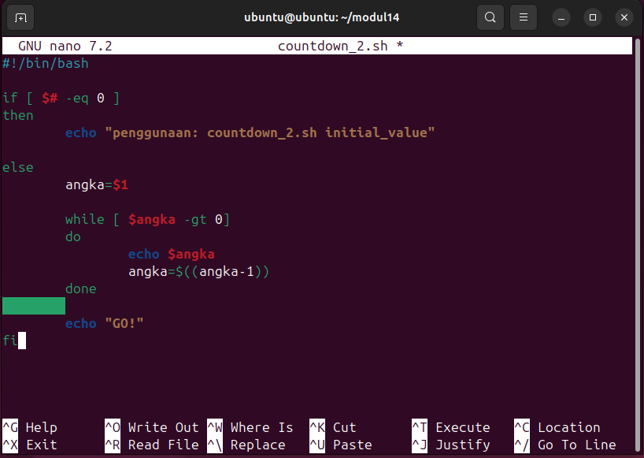

### Hasil Running

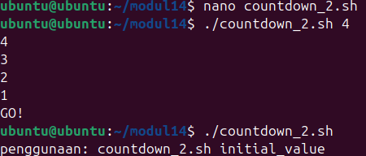

---

# Soal 6

## Soal

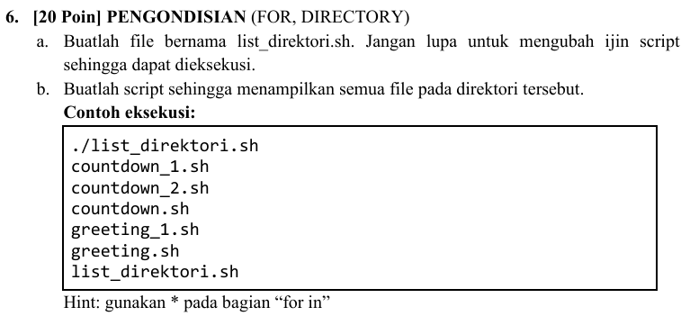

## Jawaban

### Source Code

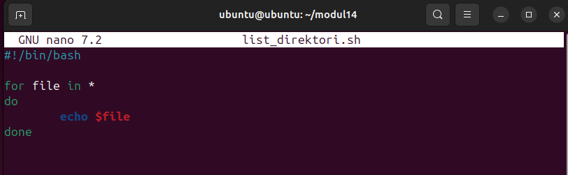

### Hasil Running

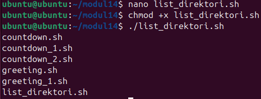

---

# Kesimpulan

Pada praktikum modul scripting ini, praktikan mempelajari dasar penggunaan Bash Script pada sistem operasi Linux. Praktikan memahami cara membuat dan menjalankan file script, menggunakan variabel, pengondisian, perulangan, input pengguna, serta parameter script. Selain itu, praktikan juga memahami bagaimana shell script dapat digunakan untuk mengotomatisasi berbagai pekerjaan pada Linux sehingga proses kerja menjadi lebih efisien dan terstruktur.